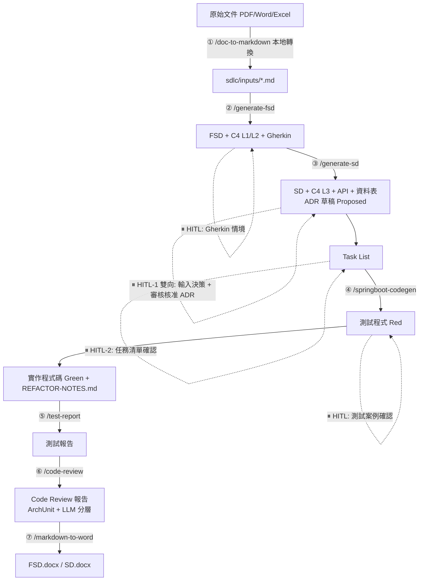

# sdlc-demo-kiro

以「壽險新保件保費試算（Life Premium）」為 MVP，端對端驗證 **Kiro Skills** 驅動的 SDLC 自動化工作流程：
從需求文件到可執行的 Spring Boot 程式碼，全程由 `.kiro/skills/` 下的 7 個 Kiro Skill 驅動，關鍵節點由人工確認（HITL）。

本專案採用 **Kiro Agent Skills**（遵循 [Agent Skills 開放標準](https://agentskills.io)，`.kiro/skills/<name>/SKILL.md`），
將 SDLC 各階段（需求 → FSD → SD/ADR → TDD/BDD 程式碼 → 測試報告 → Code Review → Word 交付）
封裝為 7 個可重複使用的 Skill，並以壽險保費試算案例完整跑過一次流程以驗證可用性。

---

## Skills 是什麼？原理與設計（給初學者）

### 1. 什麼是一個「Skill」？

一個 Skill 就是 `.kiro/skills/<skill-name>/SKILL.md` 這樣一個 Markdown 檔案，開頭是 YAML frontmatter，之後接完整執行步驟：

```markdown
---
name: generate-fsd                 # Skill 識別名稱，對應斜線指令 /generate-fsd
description: 根據需求文件或原始碼產出功能規格文件（FSD）...   # 一句話說明「何時該用這個 Skill」
---

# 這裡開始是完整的執行步驟（Step-by-step Procedure）...
```

Kiro 會拿使用者輸入的意圖，去跟每個 Skill 的 `description` 做語意比對；比對到就自動載入該 Skill 的完整內容，
使用者也可以直接打 `/skill-name` 手動指定，或用 `/skill-name #檔案` 帶入輸入文件。

### 2. 為什麼要設計成 Skill，而不是把所有規則塞進一個大提示詞？

因為每次對話能塞進去的內容（context window）有限，塞太多不相關規則只會浪費 token、稀釋重點。
Skill 的核心設計原則是**漸進式揭露（Progressive Disclosure）**：只在真正需要時才載入對應內容，分三層：

```
Session 啟動
    │
    ▼ 第 1 層｜索引層（每個 Skill 只花 ~100 tokens）
   只讀取每個 SKILL.md 的 name + description，用來判斷「這次任務該用哪個 Skill」
    │
    │  使用者輸入語意匹配到某個 description，或直接輸入 /skill-name
    ▼ 第 2 層｜指令層（完整工作流程）
   載入該 Skill 完整的 SKILL.md 內文（步驟、HITL 確認點）
    │
    │  只有 SKILL.md 內文明確指向時才繼續載入
    ▼ 第 3 層｜資源層（按需載入，用多少載多少）
   references/{template}.md（範本、樣式指南、程式碼範本）
   scripts/{tool}.py（可直接執行的工具程式，例如文件轉換腳本）
```

也就是說：**平常只花 ~100 tokens 判斷要不要用某個 Skill，真正要用才花費完整內文的 token**，
需要範本或腳本時才再多載入一點——這讓專案可以塞下大量規則細節，卻不會拖垮每次對話的效率。

### 3. 專案規範怎麼共用給所有 Skill？

分層 Skill 之外，還有一份 [`.kiro/steering/java-coding-standards.md`](.kiro/steering/java-coding-standards.md)（Kiro 的 **Steering** 機制），
內容是 Java package 命名規範、分層依賴規則、注解規範等**每次 session 都會自動載入**的強制標準，
所有 Skill 產出程式碼時都必須遵守；若與個別 `SKILL.md` 內文衝突，以這份檔案為最終依據。

| 機制 | 載入時機 | 用途 | 可攜性 |
|------|---------|------|--------|
| **Skill** | 按需（語意匹配或 `/skill-name` 呼叫） | 可重用的工作流程 | ✅ 跨專案 |
| **Steering** | 每次 session 自動載入 / 條件觸發 | 專案規範、團隊標準 | ❌ 專案綁定 |
| **Hook** | IDE 事件驅動（存檔、提交） | 自動化觸發 | ❌ 專案綁定 |

### 4. 本專案的 7 個 Skill，各自負責什麼？

| Skill | 一句話定位 |
|-------|-----------|
| [`doc-to-markdown`](.kiro/skills/doc-to-markdown/SKILL.md) | 把 PDF/Word/Excel/PPT 原始文件在本機轉成 Markdown，不上雲端 |
| [`generate-fsd`](.kiro/skills/generate-fsd/SKILL.md) | 需求文件 → 功能規格文件（FSD）+ C4 L1/L2 圖 + Gherkin BDD 情境 |
| [`generate-sd`](.kiro/skills/generate-sd/SKILL.md) | FSD → 系統設計文件（SD）+ C4 L3 圖 + API/資料表設計 + ADR + Task List |
| [`springboot-codegen`](.kiro/skills/springboot-codegen/SKILL.md) | Task List + SD + Gherkin → 依 TDD/BDD（Red→Green→Refactor）產出 Spring Boot 程式碼 |
| [`test-report`](.kiro/skills/test-report/SKILL.md) | 彙整 surefire/cucumber/jacoco 原始報告為統一格式中文測試報告 |
| [`code-review`](.kiro/skills/code-review/SKILL.md) | ArchUnit 驗結構規則、LLM 只審業務語意與資安意圖，降低 token 消耗 |
| [`markdown-to-word`](.kiro/skills/markdown-to-word/SKILL.md) | 用 Pandoc 套公司樣板，把 FSD/SD 的 Markdown 轉成交付用 .docx |

每個 Skill 更詳細的輸入/輸出與 HITL 設計，見下方「[各 Skill 詳細設計](#各-skill-詳細設計)」。

### 5. 兩個關鍵的「省 Token」設計：Docling 與 ArchUnit

漸進式揭露只解決了「載入 Skill 說明」的 token 消耗，但**執行 Skill 過程中**還有兩個更燒 token 的環節，
本專案分別用 Docling 和 ArchUnit 這兩個「確定性工具」取代 LLM，把 LLM 留給真正需要判斷力的工作：

#### (1) Docling — 把「讀文件」這件事從 LLM 手上拿走

`doc-to-markdown` Skill 面對的問題：原始需求文件常常是 PDF、Word、Excel、PPT。若直接把整份 PDF 丟給 LLM，會有兩個問題：

- **Token 爆炸**：PDF 內的表格、版面、圖片都要先被模型「看懂」再轉成文字理解，一份幾十頁的規格書可能吃掉數萬 token，且每次重新分析都要再燒一次。
- **機密外洩風險**：若使用雲端 OCR／文件理解 API，文件內容等於上傳到第三方服務。

[Docling](https://github.com/DS4SD/docling) 是**本機執行**的文件結構化解析工具，專門處理 PDF 的表格、標題階層、版面配置，
把 PDF 轉成結構清楚的 Markdown（掃描件走內建 OCR）；Office 檔（Word/Excel/PPT）則交給 Microsoft **MarkItDown**。
關鍵在於：**這一步完全不需要呼叫 LLM**——它們是傳統文件解析程式（規則 + 電腦視覺模型跑在本機），
輸出的 Markdown 這時候才會被後續 `generate-fsd` 等 Skill 讀取。

效果：LLM 只需讀「已整理好的 Markdown 純文字」，不用重複花 token 理解 PDF 版面與圖片，且文件全程留在本機。
詳見 [`.kiro/skills/doc-to-markdown/SKILL.md`](.kiro/skills/doc-to-markdown/SKILL.md)。

#### (2) ArchUnit — 把「檢查程式碼結構」這件事從 LLM 手上拿走

`code-review` Skill 面對的問題：程式碼審查裡有一大類規則其實是「機械化、非黑即白」的，例如：

- Controller 不可以直接依賴 Repository（分層依賴方向）
- Service 實作類別命名必須以 `ServiceImpl` 結尾
- package 之間不可以有循環依賴

這類規則若讓 LLM 逐檔案讀程式碼判斷，token 消耗會隨檔案數量線性增加，且 LLM 的判斷還可能不穩定（同一份程式碼兩次審查給出不同結論）。

[ArchUnit](https://www.archunit.org/) 是一個 Java 函式庫，可以把「分層依賴」「命名慣例」「循環依賴」這些架構規則寫成
**真正會被 JVM 執行的單元測試**（本專案的 `architecture/ArchitectureTest.java`）。規則只要寫一次，之後每次 `./mvnw test`
就會用編譯器等級的確定性去驗證，結果永遠一致、不消耗任何 LLM token。

效果：`code-review` 因此設計成兩階段分工——**Phase 1 結構檢查交給 ArchUnit**（0 token、結果確定），
**Phase 2 才讓 LLM 專注審查 ArchUnit 驗不出來的部分**（業務邏輯正確性、資安意圖、輸入驗證缺漏）。
詳見 [`.kiro/skills/code-review/SKILL.md`](.kiro/skills/code-review/SKILL.md)。

> **共同原則**：能用確定性工具（本機文件解析器、單元測試框架）驗證或轉換的事，就不要讓 LLM 做；
> LLM 的 token 預算應該留給「需要理解語意、無法寫成規則」的判斷。

---

## SDLC 每個步驟所需的 Skills、輸入與輸出

下圖是完整的執行流程，虛線代表需要人工確認才能繼續的 **HITL（Human-in-the-loop）** 關卡：



逐步對照表（照順序執行，前一步的輸出就是下一步的輸入）：

| 步驟 | Skill（斜線指令） | 輸入 | 輸出 | 需要人工確認（HITL）？ |
|------|------------------|------|------|----------------------|
| ① | `/doc-to-markdown` | `sdlc/inputs/raw/*.{pdf,docx,xlsx,pptx}` 原始文件 | `sdlc/inputs/*.md` | 否（本專案需求本身已是 Markdown，此步驟略過） |
| ② | `/generate-fsd` | 需求文件 / User Story / PRD / 既有原始碼 | `sdlc/fsd/output/FSD-{CODE}-v{N}.md` + `*.feature`（Gherkin） | 是：FSD 主體、Gherkin 情境需人工確認 |
| ③ | `/generate-sd` | 上一步的 FSD 文件（+ 既有已核准 ADR） | `sdlc/sd/output/SD-{CODE}-v{N}.md` + `sdlc/adr/output/ADR-NNNN-*.md` + `TASK-LIST-{CODE}-v{N}.md` | 是：HITL-1（雙向，輸入決策 + 審核核准 ADR）、HITL-2（任務清單確認） |
| ④ | `/springboot-codegen` | 上一步的 Task List + SD + Gherkin feature 檔 | `src/` 完整 Spring Boot 程式碼（先產出失敗的測試 Red，再產出讓測試轉綠的實作 Green）+ `REFACTOR-NOTES.md` | 是：Red 狀態測試案例需人工確認業務規則/邊界值後才續 Green |
| ⑤ | `/test-report` | `./mvnw test` 產出的 surefire / cucumber / jacoco 原始報告 | `sdlc/test/output/TEST-REPORT-{CODE}-v{N}.md` | 否 |
| ⑥ | `/code-review` | `src/` 原始碼 + `.kiro/steering/java-coding-standards.md` | Code Review 報告（ArchUnit 結構規則 + LLM 語意審查） | 否（發現 Blocker 會自動告警） |
| ⑦ | `/markdown-to-word` | `sdlc/fsd\|sd/output/*.md` | `*.docx` 交付文件 | 否 |

> 全流程共 **5 個 HITL 確認點**，確保 AI 產出的每個關鍵文件（FSD、Gherkin、ADR、Task List、測試案例）都經過人工把關，
> 而非全自動不受控地產生程式碼。`.kiro/steering/java-coding-standards.md` 全程自動載入，強制 code gen 與 code review 遵守規範。
> 實際執行過程與各步驟驗證結果，請見 [sdlc/README.md](sdlc/README.md)。

---

## 快速導覽

```
sdlc-demo-kiro/
├── .kiro/
│   ├── skills/                  # Kiro Skills（7 個）
│   │   ├── doc-to-markdown/     # ① 前置：文件轉 Markdown（本地）
│   │   ├── generate-fsd/        # ② FSD + Gherkin 產出
│   │   ├── generate-sd/         # ③ SD + ADR + Task List 產出
│   │   ├── springboot-codegen/  # ④ TDD/BDD Code Gen
│   │   ├── test-report/         # ⑤ 彙整測試報告
│   │   ├── code-review/         # ⑥ ArchUnit + LLM 分層審查
│   │   └── markdown-to-word/    # ⑦ Word 套版輸出
│   └── steering/                # 開發標準（每次 session 自動載入）
│       └── java-coding-standards.md
│
├── sdlc/                        # SDLC 文件（需求 → FSD → SD → ADR → Task List → 測試報告）
│   ├── inputs/                  # 原始需求
│   ├── fsd/                     # 功能規格文件 + Gherkin
│   ├── sd/                      # 系統設計文件 + Task List
│   ├── adr/                     # 架構決策紀錄（輸出；HITL-1 審核）
│   └── test/                    # 測試報告模板與輸出
│
├── src/                         # Spring Boot 實作（由 /springboot-codegen 產出）
│   ├── main/java/com/example/lifepremium/
│   └── test/java/com/example/lifepremium/
│                                #   含 architecture/ArchitectureTest.java（ArchUnit）
│
├── pom.xml                      # Maven 建置設定（含 ArchUnit）
└── mvnw / mvnw.cmd              # Maven Wrapper
```

---

## MVP 案例：壽險保費試算

### 業務情境

壽險業務員或訪客輸入被保人基本資料（年齡、性別、保額、繳費年期），系統即時計算年繳與月繳保費，協助投保決策。
完整需求見 [sdlc/inputs/LIFE-PREMIUM-requirements.md](sdlc/inputs/LIFE-PREMIUM-requirements.md)。

### 核心業務規則

| 規則 | 說明 |
|------|------|
| BR-001 | 被保人年齡 0～70 歲 |
| BR-002 | 保額 100～5,000 萬元 |
| BR-003 | 繳費年期：10 / 20 / 30 / 99 年 |
| BR-004 | 年繳保費 = ROUND(保額 ÷ 1000 × 費率) |
| BR-005 | 月繳保費 = ROUND(年繳 ÷ 12 × 1.03) |

### 計算範例

| 條件 | 值 |
|------|---|
| 商品 | LIFE-WL-01（終身壽險）|
| 年齡 / 性別 | 35 歲 / 男性 |
| 保額 | 1,000 萬元 |
| 繳費年期 | 20 年 |
| 費率 | 12.50（每千元）|
| **年繳保費** | **125,000 元** |
| **月繳保費** | **10,729 元** |

---

## 產出成果

### 文件產出

| 階段 | 文件 | 路徑 |
|------|------|------|
| 需求 | 業務需求描述 | `sdlc/inputs/LIFE-PREMIUM-requirements.md` |
| FSD | 功能規格文件 | `sdlc/fsd/output/FSD-LIFE-v1.0.md` |
| FSD | Gherkin 測試案例 | `sdlc/fsd/output/features/premium-calculation.feature` |
| SD | 系統設計文件 | `sdlc/sd/output/SD-LIFE-v1.0.md` |
| ADR | 架構決策紀錄（6 筆）| `sdlc/adr/output/ADR-0001~0006-*.md` |
| ADR | 決策日誌索引 | `sdlc/adr/README.md` |
| SD | 開發 Task List | `sdlc/sd/output/TASK-LIST-LIFE-v1.0.md` |
| 測試 | 測試報告模板 | `sdlc/test/templates/TEST-REPORT-template.md` |
| 標準 | Java 開發標準（Steering）| `.kiro/steering/java-coding-standards.md` |

### 程式碼產出

| 類型 | 檔案 |
|------|------|
| Entity | `Product`, `RateTableVersion`, `RateEntry`, `CalculationRecord` |
| Repository | `ProductRepository`, `RateEntryRepository`, `CalculationRecordRepository`, `RateTableVersionRepository` |
| Service | `PremiumCalculationService`, `RateTableService`, `CalculationRecordService` |
| Controller | `PremiumCalculationController`, `RateTableController`, `CalculationRecordController` |
| Exception | `AgeOutOfRangeException`, `AmountOutOfRangeException`, `InvalidPaymentPeriodException`, `RateNotFoundException` + `GlobalExceptionHandler` |
| Test | `PremiumCalculationServiceTest`, `PremiumCalculationControllerTest`, `RateEntryRepositoryTest` |
| BDD | `PremiumCalculationSteps` + Cucumber Runner |
| 架構測試 | `architecture/ArchitectureTest.java`（ArchUnit：分層依賴、命名慣例、循環依賴）|

---

## 技術棧

| 類別 | 選型 |
|------|------|
| 語言 | Java 17 |
| 框架 | Spring Boot 3.3 |
| ORM | Spring Data JPA + Hibernate 6 |
| 資料庫 | PostgreSQL 15 |
| 快取 | Redis 7（Cache-Aside，TTL 1hr）|
| 測試 | JUnit 5 + Mockito + Cucumber 7 |
| 架構測試 | ArchUnit 1.3（分層依賴、命名、循環依賴確定性檢查）|
| 覆蓋率 | JaCoCo |
| 文件 | Springdoc OpenAPI 2 |
| 建置 | Maven 3.9（含 Maven Wrapper）|
| 圖形 | Mermaid（C4 圖、循序圖；GitHub/GitLab 可直接預覽）|
| Word 匯出 | Pandoc + mermaid-cli（`mmdc`，本地渲染 PNG）|

---

## 快速開始

### 前置需求

- Java 17+
- Maven 3.9+（專案內含 Maven Wrapper）
- Docker（本機開發用 PostgreSQL + Redis）
- Node.js 18+ 與 `@mermaid-js/mermaid-cli`（僅 `markdown-to-word` 匯出 Word 時需要：`npm install -g @mermaid-js/mermaid-cli`）
- Pandoc（僅匯出 Word 時需要）

### 啟動本機服務

```bash
docker-compose up -d
```

### 執行測試

```bash
# 單元測試
./mvnw test -Dgroups="unit"

# 整合測試
./mvnw test -Dgroups="integration"

# BDD 測試（Cucumber）
./mvnw test -Dtest="CucumberTestRunner"

# 架構測試（ArchUnit）
./mvnw test -Dtest="ArchitectureTest"

# 全部測試 + 覆蓋率報告
./mvnw test

# 全部測試（Windows PowerShell）
.\mvnw.cmd test
```

> **Windows 家目錄含空格的 workaround：** 若家目錄路徑含空格（如 `C:\Users\Rex Wang`），
> Maven Wrapper 可能無法啟動。改用本機已安裝的 Maven 直接執行，或將 Maven 安裝於無空格路徑後以 `mvn -B test` 執行。

### 啟動應用程式

```bash
./mvnw spring-boot:run -Dspring-boot.run.profiles=local
```

API 文件：http://localhost:8080/swagger-ui.html

### 試算 API 範例

```bash
curl -X POST http://localhost:8080/api/v1/premium/calculate \
  -H "Content-Type: application/json" \
  -H "X-Agent-Id: 00000000-0000-0000-0000-000000000001" \
  -d '{
    "productCode":    "LIFE-WL-01",
    "age":            35,
    "gender":         "M",
    "insuredAmount":  1000,
    "paymentPeriod":  20
  }'
```

預期回應：

```json
{
  "code": "SUCCESS",
  "data": {
    "productCode":    "LIFE-WL-01",
    "insuredAmount":  1000,
    "paymentPeriod":  20,
    "rateUsed":       12.50,
    "annualPremium":  125000,
    "monthlyPremium": 10729
  },
  "timestamp": "2026-09-07T03:00:00Z"
}
```

---

## 各 Skill 詳細設計

### ① `doc-to-markdown` — 前置文件轉換

**觸發：** `/doc-to-markdown`　**輸入：** `sdlc/inputs/raw/*.{pdf,docx,xlsx,pptx}`　**輸出：** `sdlc/inputs/*.md`

企業文件往往以 PDF、Word、Excel 形式交付。此 Skill 在**本地端**將各種格式轉換為 Markdown，再交由後續 Skill 處理，降低 token 消耗、保護文件機密性。

| 輸入格式 | 工具 | 說明 |
|---------|------|------|
| PDF（有文字層） | Docling | 表格、標題結構萃取最佳 |
| PDF（掃描件）| Docling + OCR | 內建 EasyOCR pipeline |
| Word / Excel / PPT | MarkItDown | 速度快，Office 結構保留良好 |
| 批次多格式 | `scripts/convert.py` | 自動判斷類型 |

```
/doc-to-markdown #sdlc/inputs/raw/需求訪談紀錄.pdf
```

### ② `generate-fsd` — 功能規格文件產出

**觸發：** `/generate-fsd`　**輸入：** 需求文件、User Story、PRD 或原始碼　**輸出：** `sdlc/fsd/output/FSD-{CODE}-v{N}.md` + `.feature`

依 FSD 模板產出完整功能規格文件，附帶 **C4 Model** 與 **Gherkin 測試案例**。分階段 HITL 確認：

| Phase | 產出內容 | HITL |
|-------|---------|------|
| Phase 1 | FSD 主體 + C4 L1 System Context + C4 L2 Container + 業務循序圖 | ⏸ 確認架構與功能正確性 |
| Phase 2 | Gherkin `.feature` 檔（BDD 測試情境）| ⏸ 確認測試案例是否覆蓋所有驗收標準 |

**Gherkin 標籤策略：** `@smoke`（部署後冒煙）、`@regression`（每日 CI 迴歸）、`@happy-path`（正常流程）、`@boundary`（邊界值）、`@error-handling`（例外）、`@wip`（開發中，暫不執行）。

```
/generate-fsd #sdlc/inputs/LIFE-PREMIUM-requirements.md
```

### ③ `generate-sd` — 系統設計文件產出

**觸發：** `/generate-sd`　**輸入：** FSD（+ 先前已 `Accepted` 的 ADR）　**輸出：** `SD-{CODE}-v{N}.md` + `ADR-NNNN-*.md` + `TASK-LIST-{CODE}-v{N}.md`

以 FSD 為輸入，產出完整系統設計文件，著重技術實作細節：

| 章節 | 內容 | 對應 FSD |
|------|------|---------|
| C4 L3 Component | 各 Container 內部元件、依賴關係 | 延伸 C4 L2 |
| 技術循序圖 | 服務間呼叫鏈、非同步事件流 | 業務循序圖的技術實作面 |
| API 規格 | 完整 Request/Response schema、錯誤碼 | 功能需求 FR |
| 資料表設計 | 欄位定義、索引、關聯、快取策略 | 資料需求 |
| 安全設計 | RBAC 角色矩陣、資料加密、防護措施 | 非功能需求 |

採兩階段 HITL：

| Phase | 產出 | HITL |
|-------|------|------|
| Phase 1 | SD 文件本體 + **ADR 草稿（Proposed）** | ⏸ HITL-1（雙向）：架構師**輸入決策** + **審核核准** ADR |
| Phase 2 | 開發 Task List（列出所有待產出類別、方法、決策）| ⏸ HITL-2：確認任務清單再進 code gen |

> **ADR 是輸出、HITL-1 是雙向：** 架構決策的主體是「人」，AI 不自行拍板。`generate-sd` 先提出候選方案（含 tradeoff）
> 起草 `Proposed` ADR，架構師在 HITL-1 **輸入決策**並**審核核准**後，狀態轉 `Accepted` 並輸出至 `sdlc/adr/output/`。
> SD 的「關鍵架構決策」節僅保留 ADR 索引，完整背景／替代方案／影響記錄於各 ADR 檔。詳見 [`sdlc/adr/README.md`](sdlc/adr/README.md)。

> **Task List 的意義：** 在大量程式碼產出前，先讓架構師確認 Kiro 的理解正確，避免方向錯誤造成的重工與 token 浪費。
> `springboot-codegen` 依此 Task List 的順序驅動。

```
/generate-sd #sdlc/fsd/output/FSD-LIFE-v1.0.md
```

### ④ `springboot-codegen` — TDD/BDD 程式碼產出

**觸發：** `/springboot-codegen`　**輸入：** Task List + SD + Gherkin　**輸出：** `src/` 完整 Spring Boot 程式碼

**依 Task List 的先後順序驅動**（HITL-2 確認過的清單），遵循 **Red → Green → Refactor**，過程會**實際執行 Maven 編譯與測試**直到全數通過：

- **Phase 1 — 測試程式（🔴 Red）**：先寫測試不寫實作（Cucumber Steps、Controller/Service/Repository 測試），確保編譯過但執行失敗。⏸ **HITL**：確認測試案例正確反映業務規則與邊界值。
- **Phase 2 — 實作程式碼（🟢 Green）【自動執行】**：依 `Entity → Repository → DTO → Exception → Service → Controller → Config` 由內而外逐層產出，每步驟後即時編譯並跑對應測試，持續修正直到全綠。
- **Phase 3 — 重構建議（Refactor）**：輸出 `REFACTOR-NOTES.md`，指出程式碼異味、可抽象介面、N+1 查詢、覆蓋率缺口，**僅提建議不自動修改**。

```
/springboot-codegen
```

### ⑤ `test-report` — 測試報告彙整

**觸發：** `/test-report`　**輸入：** `target/` 下 surefire / cucumber / jacoco 原始報告　**輸出：** `sdlc/test/output/TEST-REPORT-{CODE}-v{N}.md`

套用 `sdlc/test/templates/TEST-REPORT-template.md` 彙整為統一中文測試報告：

| 來源 | 內容 |
|------|------|
| surefire | 單元/整合測試通過率、失敗案例、執行時間 |
| cucumber | BDD 情境結果（依 `@smoke` / `@regression` 標籤分群）|
| jacoco | 行/分支覆蓋率，標示未覆蓋的關鍵路徑 |
| ArchUnit | 架構規則檢查結果（分層依賴、命名、循環依賴）|

```
/test-report
```

### ⑥ `code-review` — 架構與資安審查（ArchUnit + LLM 分層）

**觸發：** `/code-review`　**輸入：** `src/` + `.kiro/steering/java-coding-standards.md`　**輸出：** Code Review 報告

採**兩層分工**，把可機械化的規則交給確定性測試，LLM 只審查真正需要判斷的語意問題，**大幅降低 token 消耗**：

| 層次 | 檢查者 | 檢查內容 |
|------|--------|---------|
| **Phase 1 結構檢查** | **ArchUnit（確定性測試）** | 分層依賴方向、package 結構、類別/方法命名慣例、注解規範、循環依賴 |
| **Phase 2 語意審查** | **LLM** | 業務邏輯正確性、資安意圖（授權、注入、機密外洩）、缺漏的輸入驗證、錯誤處理 |
| **Phase 3 報告** | LLM | 彙整問題分級（Blocker/Major/Minor），發現錯誤時告警並可回饋 code gen 修正 |

規則範本見 `.kiro/skills/code-review/references/archunit-rules.md`；對應架構測試已內建於 `src/test/.../architecture/ArchitectureTest.java`。

```
/code-review
```

### ⑦ `markdown-to-word` — Word 套版輸出

**觸發：** `/markdown-to-word`　**輸入：** `sdlc/fsd|sd/output/*.md`　**輸出：** 對應 `*.docx`

使用 **Pandoc + reference-doc** 套用公司 Word 樣板，產出可直接送審的 `.docx`，全程本地端執行。
文件中的 Mermaid 圖由 **mermaid-cli（`mmdc`）** 本地渲染為 PNG 後嵌入（不使用 PlantUML）。

| 文件類型 | 套版 | 輸出命名 |
|---------|------|---------|
| FSD | `sdlc/fsd/templates/FSD-template.docx` | `FSD-{CODE}-v{N}.docx` |
| SD | `sdlc/sd/templates/SD-template.docx` | `SD-{CODE}-v{N}.docx` |

```
/markdown-to-word #sdlc/fsd/output/FSD-LIFE-v1.0.md
```

---

## HITL（Human-in-the-Loop）確認點總覽

全流程共 **5 個 HITL 確認點**，確保關鍵決策有人工把關：

```
SDLC 流程                    HITL 確認點              確認重點
─────────────────────────────────────────────────────────────────
/generate-fsd Phase 1   →   ⏸ FSD 主體確認      架構邊界、功能完整性
                        →   ⏸ Gherkin 確認      測試情境覆蓋率、業務規則
/generate-sd  Phase 1   →   ⏸ SD + ADR 確認     雙向：架構師輸入決策 + 審核核准 ADR
              Phase 2   →   ⏸ Task List 確認    任務清單正確性（HITL-2）
/springboot-codegen     →   ⏸ 測試案例確認      Red 狀態、邊界值、測試資料
```

**HITL-1 是雙向關卡：** 不只是「審核」，還包含「輸入」——AI 先提出候選架構方案（含 tradeoff），架構師輸入實際決策，
AI 依此起草 ADR，再由架構師核准（`Proposed → Accepted`）。ADR 是產出的 artifact。

實作程式碼（Green）為**全自動**，由測試套件自動驗收；`test-report`、`code-review`、`markdown-to-word` 為產出後的自動化步驟，
`code-review` 若偵測到 Blocker 會告警並可回饋修正。

---

## 延伸閱讀

- [sdlc/README.md](sdlc/README.md) — 完整 SDLC 執行紀錄與各 Skill 驗證結果
- [sdlc/adr/README.md](sdlc/adr/README.md) — 架構決策日誌（ADR 索引）
- 各 Skill 的 `SKILL.md` — `.kiro/skills/<skill-name>/SKILL.md`
- 開發標準（Steering）— [.kiro/steering/java-coding-standards.md](.kiro/steering/java-coding-standards.md)
