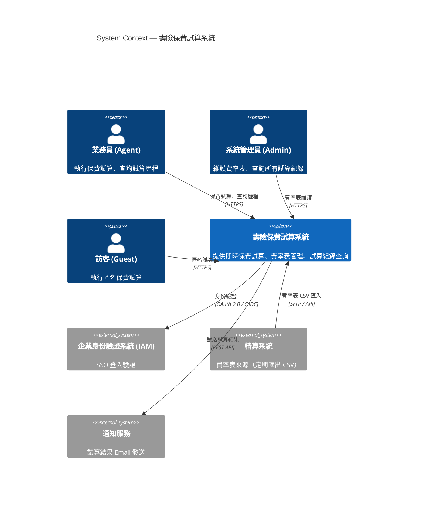
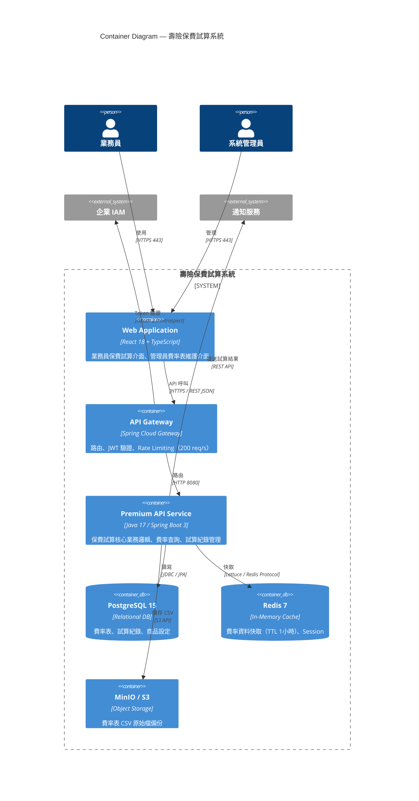
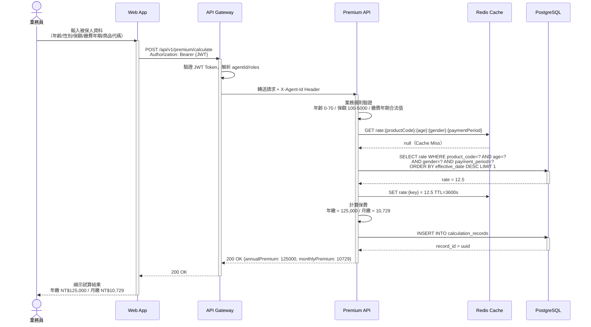
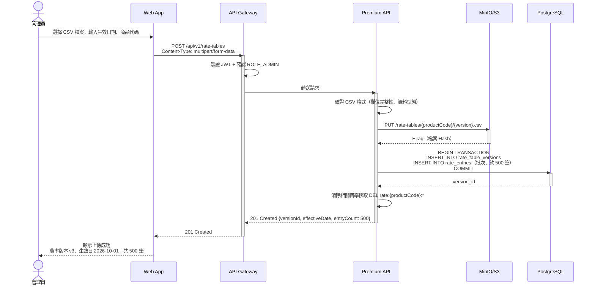

# 功能規格文件 (Functional Specification Document)

**文件編號：** FSD-LIFE-v1.0  
**專案名稱：** 壽險新保件保費試算系統  
**版本：** 1.0  
**建立日期：** 2026-09-07  
**最後更新：** 2026-09-07  
**文件狀態：** 核准  

---

## 文件修訂紀錄

| 版本 | 日期 | 修訂人 | 修訂說明 |
|------|------|--------|----------|
| 0.1  | 2026-09-07 | 業務分析師 | 初稿建立 |
| 1.0  | 2026-09-07 | 業務分析師 | 核准發行 |

---

## 1. 文件目的與範圍

### 1.1 目的

本文件描述**壽險新保件保費試算系統**的功能需求，作為開發、測試與業務單位的溝通基礎，並作為 SD 文件與測試計畫的依據。

### 1.2 範圍

- 保費即時試算（含費率查詢）
- 費率表版本管理與維護
- 試算紀錄保存與查詢

### 1.3 不在範圍內

- 實際投保申請與送件流程
- 承保核保審查
- 保單管理與理賠

---

## 2. 名詞定義與縮寫

| 名詞 / 縮寫 | 說明 |
|------------|------|
| 保費 | 要保人依約向保險公司繳納的金額 |
| 費率 | 每千元保額對應的保費金額，依年齡/性別/繳費年期查詢 |
| 保額 | 被保險人身故或全殘時可獲得的理賠金額（單位：萬元）|
| 繳費年期 | 要保人繳納保費的期間（10/20/30/99年）|
| 足歲 | 以整年計算的年齡（生日前以去年為準）|
| Agent | 壽險業務員 |
| Admin | 系統管理員 |

---

## 3. 參考文件

| 文件名稱 | 版本 | 說明 |
|----------|------|------|
| LIFE-PREMIUM-requirements.md | 1.0 | 業務需求來源 |
| 壽險公會費率計算標準 | 2025版 | 費率計算依據 |

---

## 4. 系統概述

### 4.1 系統背景

壽險公司業務員需要在客戶面談時即時提供保費報價。現行人工查閱費率手冊的方式效率低、容易出錯，且無法在行動裝置上使用。本系統提供即時、精確的線上保費試算服務。

### 4.2 系統目標

1. 業務員可在 3 秒內取得正確保費試算結果
2. 支援 200 位業務員同時操作
3. 試算紀錄完整保存，供業績追蹤使用

### 4.3 使用者族群

| 使用者角色 | 說明 | 主要使用功能 |
|-----------|------|-------------|
| 業務員（Agent） | 第一線壽險業務人員 | 保費試算、試算歷程查詢 |
| 系統管理員（Admin） | IT 維運人員 | 費率表維護、全系統試算紀錄查詢 |
| 訪客（Guest） | 未登入的一般使用者 | 匿名保費試算（不保存紀錄）|

---

## 5. 系統架構圖（C4 Model）

### 5.1 C4 L1 — System Context Diagram

> 圖 5-1：壽險保費試算系統情境圖（C4 L1）

| 對象 | 類型 | 互動說明 | 通訊方式 |
|------|------|---------|---------|
| 業務員 | 使用者 | 執行試算、查詢歷程 | Web / Mobile Browser |
| 系統管理員 | 使用者 | 費率表上傳與版本管理 | Web Browser |
| 訪客 | 使用者 | 匿名試算，結果不保存 | Web Browser |
| 企業 IAM | 外部系統 | 業務員/管理員 SSO 登入 | OAuth 2.0 |
| 精算系統 | 外部系統 | 費率表定期匯出 | SFTP 批次 |
| 通知服務 | 外部系統 | 試算結果信件 | REST API |

---

### 5.2 C4 L2 — Container Diagram

> 圖 5-2：壽險保費試算系統容器圖（C4 L2）

| Container | 技術選型 | 職責 | Port |
|-----------|---------|------|------|
| Web Application | React 18 + TypeScript | 前端介面 | 443 |
| API Gateway | Spring Cloud Gateway | 路由、認證、限流 | 443 |
| Premium API Service | Java 17 / Spring Boot 3 | 核心業務 | 8080 |
| PostgreSQL 15 | Relational DB | 資料持久化 | 5432 |
| Redis 7 | Cache | 費率快取、Session | 6379 |
| MinIO / S3 | Object Storage | CSV 原始檔備份 | 9000 |

---

## 6. 業務流程循序圖

### 6.1 保費試算（已登入業務員）（對應 FR-CALC-001）

> 圖 6-1：保費試算流程循序圖

| 步驟 | 參與者 | 動作 | 備註 |
|------|--------|------|------|
| 1 | 業務員 | 輸入五項試算參數 | 前端即時格式驗證 |
| 2 | API Gateway | 驗證 JWT | Token 無效回傳 401 |
| 3 | Premium API | 業務規則驗證 | 不合法參數回傳 422 |
| 4 | Redis Cache | 查詢費率 | Cache Miss 才查 DB |
| 5 | PostgreSQL | 查詢生效費率 | 無費率資料回傳 404 |
| 6 | Premium API | 計算年繳/月繳保費 | 依 BR-005 四捨五入 |
| 7 | PostgreSQL | 保存試算紀錄 | 依 BR-006 |

**例外情境：**
- 年齡超出 0-70 → 422 `AGE_OUT_OF_RANGE`
- 保額超出範圍 → 422 `AMOUNT_OUT_OF_RANGE`
- 費率資料不存在 → 404 `RATE_NOT_FOUND`

---

### 6.2 費率表上傳（管理員）（對應 FR-RATE-001）

> 圖 6-2：費率表上傳流程循序圖

---

## 7. 功能需求

### 7.1 保費試算模組（CALC）

#### FR-CALC-001：即時保費試算

- **優先等級：** 高
- **需求來源：** LIFE-PREMIUM-requirements.md §2
- **功能描述：**  
  業務員或訪客輸入被保人年齡（足歲）、性別、保額（萬元）、繳費年期、商品代碼，系統查詢對應費率並計算年繳與月繳保費，在 500ms 內回傳結果。

- **前置條件：**
  1. 系統存在指定商品代碼的生效費率表

- **主要流程：**
  1. 使用者輸入五項參數
  2. 系統驗證參數合法性（BR-001、BR-002、BR-003）
  3. 系統查詢 Redis 快取；Cache Miss 則查詢 DB 最新生效費率
  4. 系統依 BR-005 計算年繳保費與月繳保費
  5. 若使用者已登入（Agent/Admin），系統保存試算紀錄
  6. 系統回傳試算結果

- **替代流程：**
  - 訪客未登入：試算結果正常回傳，但不保存紀錄

- **例外處理：**
  - 年齡超出 [0, 70]：422 `AGE_OUT_OF_RANGE`，「被保人年齡須介於 0 至 70 歲」
  - 保額超出 [100, 5000]：422 `AMOUNT_OUT_OF_RANGE`，「保額須介於 100 萬至 5,000 萬元」
  - 繳費年期非合法值：422 `INVALID_PAYMENT_PERIOD`，「繳費年期須為 10、20、30 或 99」
  - 費率資料不存在：404 `RATE_NOT_FOUND`，「查無指定條件的費率資料，請聯繫精算部門」

- **驗收標準：**
  - [ ] 輸入合法參數，回傳正確年繳與月繳保費（依 BR-005 計算）
  - [ ] 年齡 = 0（邊界值）可正常試算
  - [ ] 年齡 = 70（邊界值）可正常試算
  - [ ] 年齡 = 71 回傳 422
  - [ ] 保額 = 100 萬（邊界值）可正常試算
  - [ ] 保額 = 5000 萬（邊界值）可正常試算
  - [ ] 已登入業務員試算後，試算紀錄可查詢到
  - [ ] 訪客試算後，試算紀錄不保存
  - [ ] API 回應時間 P95 < 500ms

#### FR-CALC-002：月繳保費計算

- **優先等級：** 高
- **需求來源：** BR-005
- **功能描述：**  
  月繳保費 = `ROUND(年繳保費 / 12 × 1.03)`，四捨五入至個位數（新台幣元）。

- **驗收標準：**
  - [ ] 年繳 125,000 → 月繳 = ROUND(125000 / 12 × 1.03) = 10,729
  - [ ] 計算結果無小數點（四捨五入）

---

### 7.2 費率表管理模組（RATE）

#### FR-RATE-001：費率表上傳

- **優先等級：** 高
- **需求來源：** LIFE-PREMIUM-requirements.md §2
- **功能描述：**  
  管理員上傳費率表 CSV 檔，指定商品代碼與生效日期，系統解析並批次匯入費率資料，同時清除相關 Redis 快取。

- **前置條件：**
  1. 使用者具有 ROLE_ADMIN 角色
  2. 生效日期 ≥ 今日（BR-004）

- **主要流程：**
  1. 管理員上傳 CSV + 輸入商品代碼與生效日期
  2. 系統驗證 CSV 格式（欄位：age, gender, payment_period, rate）
  3. 系統儲存 CSV 原始檔至 MinIO/S3
  4. 系統批次 INSERT 費率資料（約 500 筆）
  5. 系統清除 Redis 中該商品的費率快取
  6. 回傳版本資訊與匯入筆數

- **例外處理：**
  - CSV 格式錯誤：400 `INVALID_CSV_FORMAT`
  - 生效日期早於今日：422 `INVALID_EFFECTIVE_DATE`
  - 相同商品代碼已有同日生效版本：409 `RATE_VERSION_CONFLICT`

- **驗收標準：**
  - [ ] 合法 CSV 上傳成功，回傳 201 含版本 ID 與匯入筆數
  - [ ] 生效日期 = 今日可成功上傳
  - [ ] 生效日期早於今日回傳 422
  - [ ] CSV 欄位缺失回傳 400
  - [ ] 上傳後費率試算取用新版本資料

#### FR-RATE-002：費率表版本清單查詢

- **優先等級：** 中
- **需求來源：** BR-004
- **功能描述：**  
  管理員可查詢指定商品的所有費率版本清單（版本號、生效日期、建立時間、狀態）。

- **驗收標準：**
  - [ ] 回傳清單依生效日期降冪排序
  - [ ] 每筆包含：versionId、productCode、effectiveDate、entryCount、createdAt、status

---

### 7.3 試算紀錄模組（RECORD）

#### FR-RECORD-001：試算紀錄查詢

- **優先等級：** 中
- **需求來源：** LIFE-PREMIUM-requirements.md §2
- **功能描述：**  
  已登入的業務員可查詢自己最近 90 天的試算歷程，支援分頁（預設每頁 20 筆）。管理員可查詢全部業務員的紀錄。

- **驗收標準：**
  - [ ] 業務員只能看到自己的試算紀錄
  - [ ] 管理員可查詢所有紀錄
  - [ ] 預設回傳最近 90 天，依建立時間降冪排序
  - [ ] 支援分頁，預設 20 筆/頁

---

## 8. 非功能需求

### 8.1 效能需求

| 指標 | 目標值 | 量測方式 |
|------|--------|---------|
| 試算 API P95 回應時間 | ≤ 500 ms | k6 壓力測試 |
| 費率查詢（Cache Hit）| ≤ 50 ms | APM 監控 |
| 並發使用者數 | ≥ 200 | k6 並發測試 |

### 8.2 安全性需求

- 所有 API 須驗證 JWT（訪客試算端點除外）
- 費率表上傳限 ROLE_ADMIN
- 業務員只能存取自己的試算紀錄
- 傳輸使用 TLS 1.3

### 8.3 可用性需求

- 系統可用性：99.9%（每月允許停機 ≤ 43 分鐘）

### 8.4 相容性需求

| 類別 | 規格 |
|------|------|
| 瀏覽器 | Chrome 最新版、Edge 最新版、Safari 最新版 |
| 行動裝置 | iOS 15+、Android 11+ |

---

## 9. 使用者介面需求

### 9.1 設計原則

- 符合公司 Design System（Ant Design 5.x）
- 支援 RWD，優先行動裝置
- 試算表單欄位即時驗證（輸入離焦後觸發）

### 9.2 畫面清單

| 畫面 ID | 畫面名稱 | 說明 | 關聯功能 |
|---------|---------|------|---------|
| SCR-001 | 保費試算頁 | 輸入被保人資料並取得試算結果 | FR-CALC-001, FR-CALC-002 |
| SCR-002 | 試算歷程頁 | 查詢自己的試算記錄 | FR-RECORD-001 |
| SCR-003 | 費率表管理頁 | 上傳費率表、查詢版本清單 | FR-RATE-001, FR-RATE-002 |

---

## 10. 資料需求

### 10.1 主要資料實體

| 實體名稱 | 說明 | 關聯實體 |
|---------|------|---------|
| Product | 保險商品 | RateTableVersion |
| RateTableVersion | 費率表版本 | RateEntry, Product |
| RateEntry | 費率明細（年齡/性別/年期/費率）| RateTableVersion |
| CalculationRecord | 試算紀錄 | Agent（外部用戶 ID）|

### 10.2 資料保留政策

- 試算紀錄：保留 7 年（法規要求）
- 費率表版本：永久保留（精算依據）
- CSV 原始檔：永久保留於 MinIO/S3

---

## 11. 整合需求

### 11.1 外部系統整合

| 系統名稱 | 整合方式 | 資料方向 | 說明 |
|---------|---------|---------|------|
| 企業 IAM | OAuth 2.0 / JWT | 輸入 | 身份驗證與角色授權 |
| 精算系統 | SFTP 批次 / API | 輸入 | 費率表 CSV 定期匯入 |
| 通知服務 | REST API | 輸出 | 試算結果信件發送（選用）|

---

## 12. 限制與假設

### 12.1 限制條件

- 費率計算公式固定為 `保額 / 1000 × 費率`，不支援動態公式
- CSV 格式欄位固定：`age, gender, payment_period, rate`

### 12.2 假設前提

- 企業 IAM 已提供 OAuth 2.0 / JWT 機制
- 精算部門負責費率資料正確性，本系統不驗證費率合理性
- 初版僅支援新台幣計價

---

## 13. Gherkin 測試案例

> Gherkin 完整內容請見 `sdlc/fsd/output/features/premium-calculation.feature`

### 13.1 Feature 清單

| Feature 檔案 | 對應模組 | Scenario 數 | 對應 FR |
|-------------|---------|------------|--------|
| `premium-calculation.feature` | 保費試算 | 10 | FR-CALC-001, FR-CALC-002 |
| `rate-table-management.feature` | 費率表管理 | 6 | FR-RATE-001, FR-RATE-002 |
| `calculation-record.feature` | 試算紀錄 | 4 | FR-RECORD-001 |

---

## 14. 審查與核准

| 角色 | 姓名 | 簽核日期 | 備註 |
|------|------|---------|------|
| 業務需求方 | 壽險業務部主管 | 2026-09-07 | |
| 產品負責人 | PO | 2026-09-07 | |
| 技術主管 | Tech Lead | 2026-09-07 | |
| 品保主管 | QA Lead | 2026-09-07 | |

---

*本文件由 Kiro SDLC generate-fsd skill 產生，依據 LIFE-PREMIUM-requirements.md 撰寫。*
