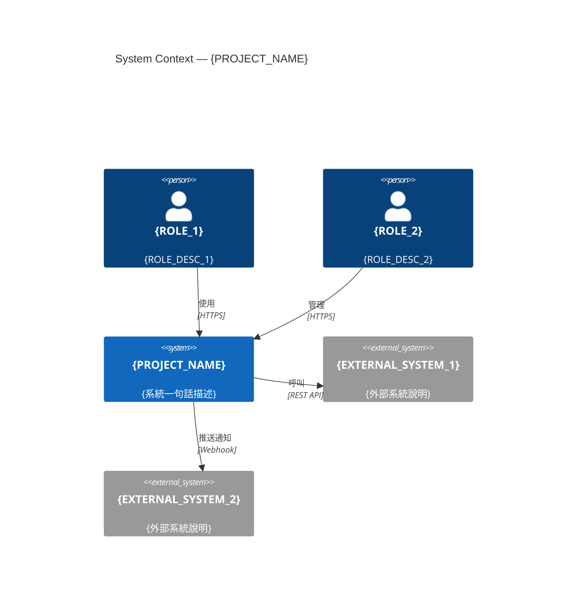
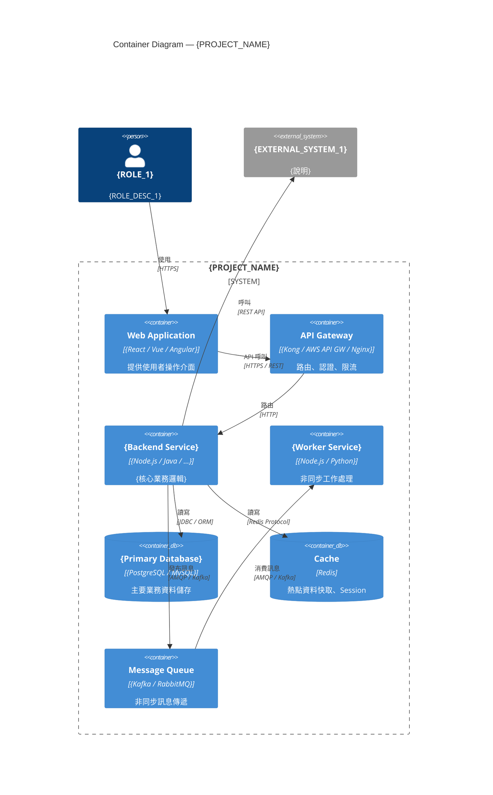
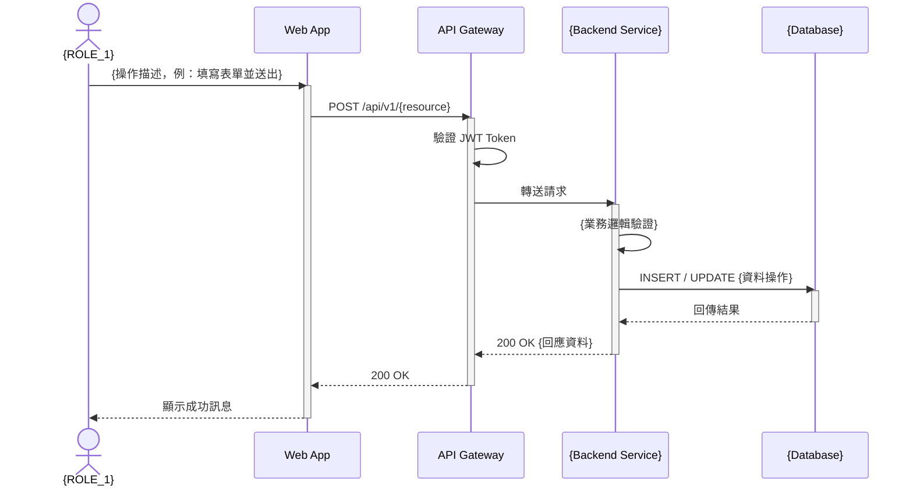
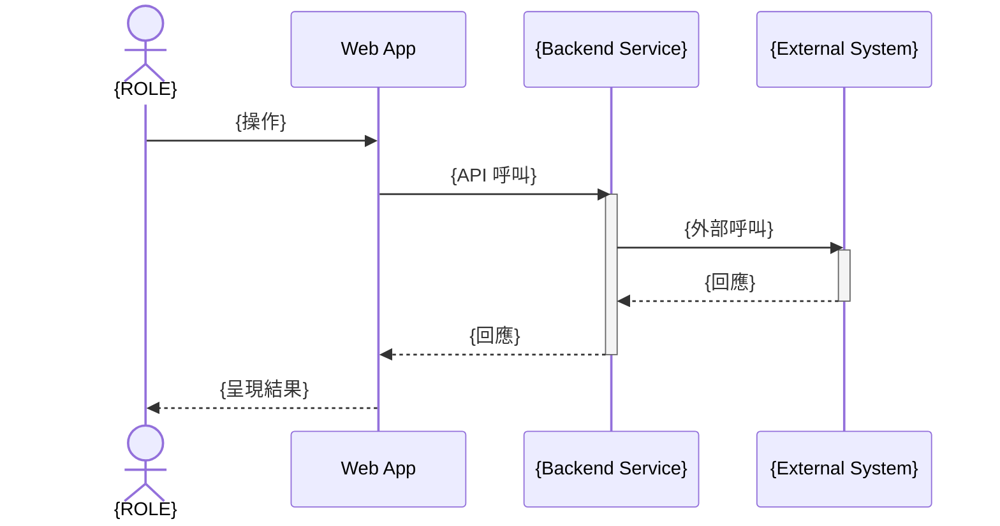

# 功能規格文件 (Functional Specification Document)

**文件編號：** FSD-{PROJECT_CODE}-{VERSION}  
**專案名稱：** {PROJECT_NAME}  
**版本：** {VERSION}  
**建立日期：** {DATE}  
**最後更新：** {LAST_UPDATED}  
**文件狀態：** 草稿 / 審查中 / 核准  

---

## 文件修訂紀錄

| 版本 | 日期 | 修訂人 | 修訂說明 |
|------|------|--------|----------|
| 0.1  | {DATE} | {AUTHOR} | 初稿建立 |

---

## 1. 文件目的與範圍

### 1.1 目的

本文件旨在描述 **{PROJECT_NAME}** 系統的功能需求，作為開發團隊、測試團隊與業務單位之間的溝通基礎，並作為後續系統設計與測試計畫的依據。

### 1.2 範圍

本文件涵蓋以下功能範圍：

- {SCOPE_ITEM_1}
- {SCOPE_ITEM_2}
- {SCOPE_ITEM_3}

### 1.3 不在範圍內

- {OUT_OF_SCOPE_1}
- {OUT_OF_SCOPE_2}

---

## 2. 名詞定義與縮寫

| 名詞 / 縮寫 | 說明 |
|------------|------|
| FSD | Functional Specification Document，功能規格文件 |
| {TERM_1} | {DEFINITION_1} |
| {TERM_2} | {DEFINITION_2} |

---

## 3. 參考文件

| 文件名稱 | 版本 | 說明 |
|----------|------|------|
| 需求訪談紀錄 | {VERSION} | 業務需求來源 |
| {DOC_NAME} | {VERSION} | {DOC_DESC} |

---

## 4. 系統概述

### 4.1 系統背景

{描述系統的業務背景，說明為何需要此系統或功能，以及預期解決的問題。}

### 4.2 系統目標

1. {GOAL_1}
2. {GOAL_2}
3. {GOAL_3}

### 4.3 使用者族群

| 使用者角色 | 說明 | 主要使用功能 |
|-----------|------|-------------|
| {ROLE_1} | {ROLE_DESC_1} | {FEATURES_1} |
| {ROLE_2} | {ROLE_DESC_2} | {FEATURES_2} |

---

## 5. 系統架構圖（C4 Model）

> 本節使用 [C4 Model](https://c4model.com) 描述系統架構的前兩個層次，提供業務與技術人員共同理解的視覺化基礎。  
> 圖表以 **Mermaid** 繪製，可直接在 GitHub / GitLab / Obsidian / VS Code 預覽，無需額外工具。

### 5.1 C4 L1 — System Context Diagram（系統情境圖）

**目的：** 說明 {PROJECT_NAME} 系統與外部使用者、外部系統之間的高階關係。



> 圖 5-1：{PROJECT_NAME} 系統情境圖（C4 L1）

**外部關係說明：**

| 對象 | 類型 | 互動說明 | 通訊方式 |
|------|------|---------|---------|
| {ROLE_1} | 使用者 | {互動說明} | Web / Mobile |
| {ROLE_2} | 使用者 | {互動說明} | Web |
| {EXTERNAL_SYSTEM_1} | 外部系統 | {互動說明} | REST API |
| {EXTERNAL_SYSTEM_2} | 外部系統 | {互動說明} | Webhook |

---

### 5.2 C4 L2 — Container Diagram（容器圖）

**目的：** 說明 {PROJECT_NAME} 系統內部由哪些可部署單元（Container）組成，以及它們之間的互動關係。



> 圖 5-2：{PROJECT_NAME} 容器圖（C4 L2）

**Container 清單：**

| Container | 技術選型 | 職責 | 對外 Port |
|-----------|---------|------|---------|
| Web Application | {框架} | 使用者介面 | 443 (HTTPS) |
| API Gateway | {工具} | 路由、認證、限流 | 443 (HTTPS) |
| {Backend Service} | {框架} | 核心業務邏輯 | 8080 (HTTP) |
| {Worker Service} | {框架} | 非同步工作處理 | — |
| {Primary Database} | {DB} | 主要資料儲存 | 5432 |
| Cache | Redis | 快取、Session | 6379 |
| Message Queue | {MQ} | 非同步訊息 | {PORT} |

---

## 6. 業務流程循序圖

> 本節針對核心業務流程，以 UML Sequence Diagram 描述使用者與系統的互動時序。  
> 使用 **Mermaid** 繪製，可直接在 GitHub / GitLab 預覽。

### 6.1 {核心流程一}（對應 FR-{MODULE}-{N}）

**流程說明：** {簡述此流程的業務目的}



> 圖 6-1：{流程名稱} 循序圖

**流程步驟說明：**

| 步驟 | 參與者 | 動作 | 備註 |
|------|--------|------|------|
| 1 | {ROLE_1} | {動作描述} | {備註} |
| 2 | Web App | {動作描述} | {備註} |
| 3 | API Gateway | 驗證 Token | JWT 驗證失敗回傳 401 |
| 4 | {Backend} | {業務邏輯} | {備註} |
| 5 | Database | {資料操作} | {備註} |

**例外情境：**
- Token 無效 → API Gateway 回傳 401，前端導向登入頁
- {業務驗證失敗} → 回傳 422，顯示 {ERROR_MESSAGE}

---

### 6.2 {核心流程二}（對應 FR-{MODULE}-{N}）

**流程說明：** {簡述此流程的業務目的}



> 圖 6-2：{流程名稱} 循序圖

---

## 7. 功能需求

> 每個功能項目依 **FR-{模組代碼}-{序號}** 編號，便於追蹤與引用。

### 7.1 {模組名稱一}

#### FR-{MODULE1}-001：{功能名稱}

- **優先等級：** 高 / 中 / 低
- **需求來源：** {來源文件或訪談紀錄}
- **功能描述：**  
  {詳細說明此功能的用途與行為。}

- **前置條件：**
  1. {PRE_CONDITION_1}

- **主要流程：**
  1. 使用者執行 {ACTION_1}
  2. 系統回應 {RESPONSE_1}
  3. {STEP_3}

- **替代流程：**
  - 若 {CONDITION}，則 {ALTERNATIVE_FLOW}

- **例外處理：**
  - 若 {ERROR_CONDITION}，系統顯示 {ERROR_MESSAGE}

- **驗收標準：**
  - [ ] {ACCEPTANCE_CRITERIA_1}
  - [ ] {ACCEPTANCE_CRITERIA_2}

---

#### FR-{MODULE1}-002：{功能名稱}

- **優先等級：** 高 / 中 / 低
- **需求來源：** {來源}
- **功能描述：**  
  {描述}

- **驗收標準：**
  - [ ] {CRITERIA}

---

### 7.2 {模組名稱二}

#### FR-{MODULE2}-001：{功能名稱}

- **優先等級：** 高 / 中 / 低
- **需求來源：** {來源}
- **功能描述：**  
  {描述}

- **驗收標準：**
  - [ ] {CRITERIA}

---

## 8. 非功能需求

### 8.1 效能需求

| 指標 | 目標值 | 量測方式 |
|------|--------|---------|
| 頁面載入時間 | ≤ 3 秒 | Lighthouse / 壓測 |
| API 回應時間 | ≤ 500 ms | APM 監控 |
| 並發使用者數 | ≥ {CONCURRENT_USERS} | 壓力測試 |

### 8.2 安全性需求

- 所有 API 須實作身份驗證（JWT / OAuth 2.0）
- 敏感資料傳輸須使用 TLS 1.2 以上
- 使用者密碼以 bcrypt 加密儲存
- {SECURITY_REQUIREMENT}

### 8.3 可用性需求

- 系統可用性：{AVAILABILITY}%（例：99.9%）
- 計畫性維護時間：每月 {MAINTENANCE_WINDOW}
- 資料備份頻率：{BACKUP_FREQUENCY}

### 8.4 相容性需求

| 類別 | 規格 |
|------|------|
| 瀏覽器支援 | Chrome 最新版、Edge 最新版、Firefox 最新版 |
| 行動裝置 | iOS 14+、Android 10+ |
| 螢幕解析度 | 最低 1280×720 |

---

## 9. 使用者介面需求

### 9.1 設計原則

- 符合公司 UI/UX 規範與設計系統
- 支援 RWD（響應式網頁設計）
- 遵循 WCAG 2.1 AA 無障礙規範

### 9.2 畫面清單

| 畫面 ID | 畫面名稱 | 說明 | 關聯功能 |
|---------|---------|------|---------|
| SCR-001 | {SCREEN_NAME} | {SCREEN_DESC} | {RELATED_FR} |

### 9.3 畫面描述

#### SCR-001：{畫面名稱}

**畫面用途：** {說明此畫面的目的}

**畫面元素：**

| 元素 | 類型 | 說明 | 驗證規則 |
|------|------|------|---------|
| {FIELD_1} | 文字輸入 | {DESC} | {RULE} |
| {FIELD_2} | 下拉選單 | {DESC} | {RULE} |

---

## 10. 資料需求

### 10.1 主要資料實體

| 實體名稱 | 說明 | 關聯實體 |
|---------|------|---------|
| {ENTITY_1} | {DESC} | {RELATED} |
| {ENTITY_2} | {DESC} | {RELATED} |

### 10.2 資料保留政策

- 交易紀錄：保留 {RETENTION_PERIOD} 年
- 使用者操作日誌：保留 {LOG_RETENTION} 個月
- {DATA_POLICY}

---

## 11. 整合需求

### 11.1 外部系統整合

| 系統名稱 | 整合方式 | 資料方向 | 說明 |
|---------|---------|---------|------|
| {SYSTEM_1} | REST API / 批次檔案 / Message Queue | 雙向 / 輸入 / 輸出 | {DESC} |

---

## 12. 限制與假設

### 12.1 限制條件

- {CONSTRAINT_1}
- {CONSTRAINT_2}

### 12.2 假設前提

- {ASSUMPTION_1}
- {ASSUMPTION_2}

---

## 13. Gherkin 測試案例

> 本章節依據第 7 章功能需求，為每個核心情境產出 Gherkin `.feature` 檔，作為 BDD 測試準備基礎。  
> 每個 Feature 對應一個功能模組，每個 Scenario 對應一個 FR 的驗收標準或業務情境。  
> 來源檔存放於 `sdlc/fsd/output/features/`，命名規則：`{MODULE_CODE}-{feature-name}.feature`

### 13.1 Gherkin 撰寫規範

- **Feature**：對應功能模組，一個模組一個 `.feature` 檔
- **Scenario**：對應單一業務情境（正常流程、替代流程、例外情境各自獨立）
- **Given**：前置狀態（系統狀態、使用者角色、資料準備）
- **When**：使用者執行的動作
- **Then**：系統預期回應與結果
- **And / But**：延伸同一步驟的額外條件
- **Scenario Outline + Examples**：用於多組資料驗證的參數化情境

### 13.2 {模組名稱一} Feature

**檔案：** `sdlc/fsd/output/features/{MODULE1_CODE}-{feature-name}.feature`

```gherkin
# encoding: UTF-8
# language: zh-TW

@{module_tag} @{priority_tag}
Feature: {模組功能名稱}
  作為 {使用者角色}
  我希望能夠 {功能目的}
  以便 {業務價值}

  Background:
    Given 使用者已登入系統
    And 使用者具有 "{ROLE}" 角色

  # 對應 FR-{MODULE1}-001 正常流程
  @smoke @happy-path
  Scenario: {正常情境名稱}
    Given {前置條件描述}
    When 使用者 {執行動作}
    Then 系統應 {預期回應}
    And {額外驗證條件}

  # 對應 FR-{MODULE1}-001 替代流程
  @regression
  Scenario: {替代情境名稱}
    Given {前置條件描述}
    And {額外前置條件}
    When 使用者 {執行動作}
    Then 系統應 {替代回應}

  # 對應 FR-{MODULE1}-001 例外情境
  @regression @error-handling
  Scenario: {例外情境名稱}
    Given {前置條件描述}
    When 使用者 {觸發例外的動作}
    Then 系統應顯示錯誤訊息 "{ERROR_MESSAGE}"
    And 系統應保持 {資料/狀態不變}

  # 參數化情境範例（多組資料驗證）
  @regression @boundary
  Scenario Outline: {參數化情境名稱}
    Given {前置條件}
    When 使用者輸入 "<{欄位名稱}>"
    Then 系統應回應 "<預期結果>"

    Examples:
      | {欄位名稱}   | 預期結果       |
      | {VALUE_1}   | {RESULT_1}    |
      | {VALUE_2}   | {RESULT_2}    |
      | {邊界值}     | {邊界結果}    |
```

### 13.3 {模組名稱二} Feature

**檔案：** `sdlc/fsd/output/features/{MODULE2_CODE}-{feature-name}.feature`

```gherkin
# encoding: UTF-8
# language: zh-TW

@{module_tag}
Feature: {模組功能名稱}
  作為 {使用者角色}
  我希望能夠 {功能目的}
  以便 {業務價值}

  Background:
    Given {共同前置條件}

  @smoke @happy-path
  Scenario: {正常情境名稱}
    Given {前置條件}
    When {動作}
    Then {預期結果}

  @regression @error-handling
  Scenario: {例外情境名稱}
    Given {前置條件}
    When {觸發例外動作}
    Then {例外處理結果}
```

### 13.4 Gherkin 標籤規範

| 標籤 | 用途 | 執行時機 |
|------|------|---------|
| `@smoke` | 冒煙測試核心情境 | 每次部署後立即執行 |
| `@regression` | 完整迴歸測試情境 | 每日 CI / 版本發布前 |
| `@happy-path` | 正常流程情境 | 含於 smoke |
| `@error-handling` | 例外與錯誤情境 | 含於 regression |
| `@boundary` | 邊界值測試 | 含於 regression |
| `@wip` | 開發中，暫不執行 | 排除於 CI |

### 13.5 Feature 清單

| Feature 檔案 | 對應模組 | Scenario 數 | 對應 FR |
|-------------|---------|------------|--------|
| `{MODULE1_CODE}-{name}.feature` | {模組一} | {N} | {FR_IDS} |
| `{MODULE2_CODE}-{name}.feature` | {模組二} | {N} | {FR_IDS} |

---

## 14. 審查與核准

| 角色 | 姓名 | 簽核日期 | 備註 |
|------|------|---------|------|
| 業務需求方 | {NAME} | {DATE} | |
| 產品負責人 | {NAME} | {DATE} | |
| 技術主管 | {NAME} | {DATE} | |
| 品保主管 | {NAME} | {DATE} | |

---

*本文件由 Kiro SDLC 工作流程產生，版本控制請參考 Git 歷史紀錄。*
