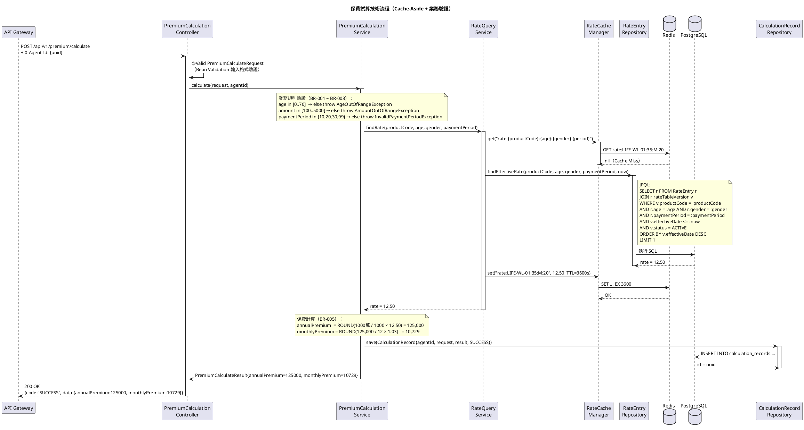
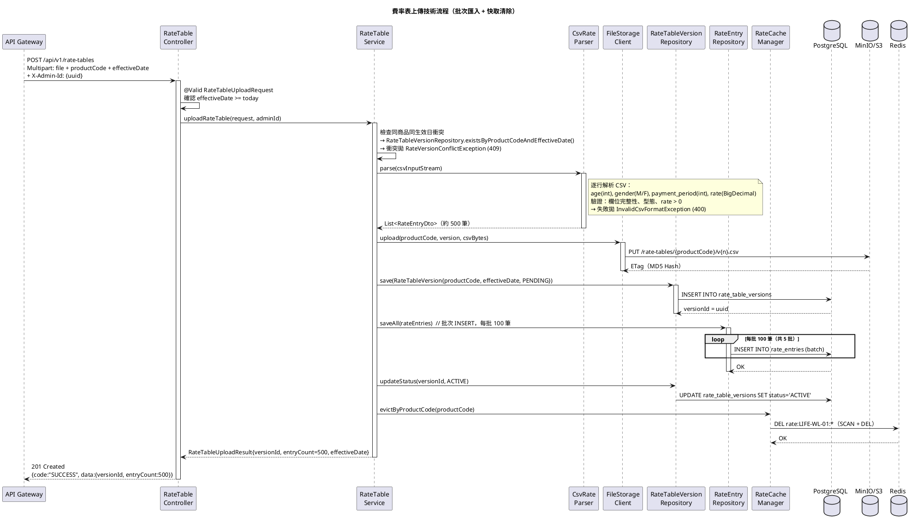

# 系統設計文件 (System Design Document)

**文件編號：** SD-LIFE-v1.0  
**專案名稱：** 壽險新保件保費試算系統  
**版本：** 1.0  
**建立日期：** 2026-09-07  
**最後更新：** 2026-09-07  
**文件狀態：** 核准  

---

## 文件修訂紀錄

| 版本 | 日期 | 修訂人 | 修訂說明 |
|------|------|--------|----------|
| 0.1  | 2026-09-07 | Tech Lead | 初稿建立 |
| 1.0  | 2026-09-07 | Tech Lead | 核准發行 |

---

## 輸入文件參照

| 文件名稱 | 版本 | 說明 |
|---------|------|------|
| FSD-LIFE-v1.0.md | 1.0 | 功能規格文件（主要輸入來源）|
| LIFE-PREMIUM-requirements.md | 1.0 | 原始業務需求 |
| 企業技術標準規範 | 2026版 | Java 17 / Spring Boot 3 技術棧標準 |

---

## 1. 文件目的與範圍

### 1.1 目的

本文件依據 FSD-LIFE-v1.0 定義的功能需求，說明壽險保費試算系統的技術設計，包含 C4 L3 元件設計、技術循序圖、API 規格、資料表設計、安全設計與部署架構，作為開發團隊實作依據。

### 1.2 範圍

| 面向 | 說明 |
|------|------|
| 系統邊界 | Premium API Service（Spring Boot）為本文件主要設計對象 |
| 技術範圍 | Java 17、Spring Boot 3.3、PostgreSQL 15、Redis 7 |
| 不在範圍 | Web Application 前端設計、API Gateway 設定、IAM 系統 |

---

## 2. 名詞定義與縮寫

| 名詞 / 縮寫 | 說明 |
|------------|------|
| BR | Business Rule，業務規則（參照 FSD §BR-001~BR-006）|
| FR | Functional Requirement，功能需求 |
| ADR | Architecture Decision Record |
| TTL | Time To Live，快取存活時間 |
| DLQ | Dead Letter Queue，死信佇列 |

---

## 3. 系統架構概觀

### 3.1 架構風格

- **架構模式：** Modular Monolith（Premium API Service 內部模組化）
- **部署模式：** Cloud-Native（容器化）
- **雲端平台：** On-Premise / 私有雲（第一版），可遷移至 AWS

### 3.2 高階架構圖（已於 FSD C4 L2 定義）

> 參照 FSD-LIFE-v1.0.md §5.2 Container Diagram。  
> Premium API Service 內部設計詳見本文件第 4 章 C4 L3。

### 3.3 關鍵架構決策

| ADR 編號 | 決策摘要 | 選擇 | 主要理由 |
|---------|---------|------|---------|
| ADR-001 | 架構風格 | Modular Monolith | 團隊規模小、降低分散式複雜度；業務邊界清晰可未來拆分 |
| ADR-002 | 後端語言與框架 | Java 17 / Spring Boot 3.3 | 企業技術標準；虛擬執行緒（Loom）提升並發效能 |
| ADR-003 | 資料庫 | PostgreSQL 15 | 支援 JSON 欄位、Partial Index；費率資料關聯查詢複雜度高 |
| ADR-004 | 快取策略 | Redis Cache-Aside | 費率資料讀多寫少，TTL 1小時符合業務需求 |
| ADR-005 | ORM | Spring Data JPA + Hibernate 6 | 企業標準；Hibernate 6 支援 Jakarta EE 9 |
| ADR-006 | DTO 映射 | MapStruct | 編譯期生成，零反射效能損耗 |

---

## 4. C4 L3 — Component Diagram（元件圖）

### 4.1 Premium API Service 元件圖

```plantuml
@startuml C4_L3_LIFE
!include https://raw.githubusercontent.com/plantuml-stdlib/C4-PlantUML/master/C4_Component.puml

title Component Diagram — Premium API Service

Container_Boundary(premium_api, "Premium API Service (Spring Boot 3)") {

    ' ── 保費試算模組 ──
    Component(calc_controller, "PremiumCalculationController", "REST Controller", "處理 POST /api/v1/premium/calculate 請求")
    Component(calc_service, "PremiumCalculationService", "Service", "保費試算核心邏輯、BR-001~BR-005 業務規則驗證")
    Component(rate_query_service, "RateQueryService", "Service", "費率查詢：先查 Redis，Cache Miss 再查 DB")

    ' ── 費率表管理模組 ──
    Component(rate_controller, "RateTableController", "REST Controller", "處理 POST /api/v1/rate-tables 費率上傳")
    Component(rate_service, "RateTableService", "Service", "CSV 解析、批次匯入、版本管理、快取清除")
    Component(csv_parser, "CsvRateParser", "Component", "解析 CSV：age, gender, payment_period, rate")
    Component(storage_client, "FileStorageClient", "HTTP Client", "上傳 CSV 原始檔至 MinIO/S3")

    ' ── 試算紀錄模組 ──
    Component(record_controller, "CalculationRecordController", "REST Controller", "處理 GET /api/v1/calculation-records 查詢")
    Component(record_service, "CalculationRecordService", "Service", "試算紀錄 CRUD、權限過濾（Agent 只看自己）")

    ' ── 共用基礎設施 ──
    Component(rate_repo, "RateEntryRepository", "JPA Repository", "費率明細資料存取")
    Component(version_repo, "RateTableVersionRepository", "JPA Repository", "費率版本資料存取")
    Component(record_repo, "CalculationRecordRepository", "JPA Repository", "試算紀錄資料存取")
    Component(cache_manager, "RateCacheManager", "Cache Component", "Redis 費率快取封裝：GET/SET/EVICT")
    Component(exception_handler, "GlobalExceptionHandler", "Advice", "@RestControllerAdvice 統一例外處理")
}

Container(api_gw, "API Gateway", "Spring Cloud Gateway", "")
ContainerDb(postgres, "PostgreSQL 15", "", "")
ContainerDb(redis, "Redis 7", "", "")
Container(minio, "MinIO / S3", "", "")

Rel(api_gw, calc_controller, "POST /calculate", "HTTP")
Rel(api_gw, rate_controller, "POST /rate-tables", "HTTP")
Rel(api_gw, record_controller, "GET /calculation-records", "HTTP")

Rel(calc_controller, calc_service, "呼叫試算")
Rel(calc_service, rate_query_service, "查詢費率")
Rel(calc_service, record_repo, "保存試算紀錄")
Rel(rate_query_service, cache_manager, "查詢/寫入快取")
Rel(rate_query_service, rate_repo, "Cache Miss 時查詢 DB")

Rel(rate_controller, rate_service, "委派上傳處理")
Rel(rate_service, csv_parser, "解析 CSV")
Rel(rate_service, storage_client, "備份原始檔")
Rel(rate_service, version_repo, "建立版本紀錄")
Rel(rate_service, rate_repo, "批次 INSERT 費率")
Rel(rate_service, cache_manager, "清除費率快取")

Rel(record_controller, record_service, "查詢紀錄")
Rel(record_service, record_repo, "資料存取")

Rel(cache_manager, redis, "快取操作", "Lettuce")
Rel(rate_repo, postgres, "讀寫", "JPA/JDBC")
Rel(version_repo, postgres, "讀寫", "JPA/JDBC")
Rel(record_repo, postgres, "讀寫", "JPA/JDBC")
Rel(storage_client, minio, "上傳 CSV", "S3 API")

@enduml
```

> 圖 4-1：Premium API Service 元件圖（C4 L3）

### 4.2 元件清單

| 元件名稱 | 類型 | 職責 | 對應 FR |
|---------|------|------|--------|
| `PremiumCalculationController` | Controller | 試算 HTTP 請求處理 | FR-CALC-001 |
| `PremiumCalculationService` | Service | 試算業務邏輯、BR 驗證 | FR-CALC-001, FR-CALC-002 |
| `RateQueryService` | Service | Cache-Aside 費率查詢 | FR-CALC-001 |
| `RateTableController` | Controller | 費率上傳 HTTP 處理 | FR-RATE-001 |
| `RateTableService` | Service | CSV 匯入、版本管理 | FR-RATE-001, FR-RATE-002 |
| `CsvRateParser` | Component | CSV 格式解析與驗證 | FR-RATE-001 |
| `FileStorageClient` | HTTP Client | MinIO/S3 檔案操作 | FR-RATE-001 |
| `CalculationRecordController` | Controller | 試算紀錄查詢 | FR-RECORD-001 |
| `CalculationRecordService` | Service | 紀錄 CRUD、權限過濾 | FR-RECORD-001 |
| `RateCacheManager` | Cache | Redis 快取封裝 | — |
| `GlobalExceptionHandler` | Advice | 統一例外回應 | — |

---

## 5. 技術層循序圖

### 5.1 保費試算技術流程（對應 FSD 圖 6-1）



> 圖 5-1：保費試算技術流程（Cache-Aside）

| 決策點 | 實作方式 | 說明 |
|--------|---------|------|
| Bean Validation | `@Valid` + `@Min`/`@Max` | Controller 層攔截格式錯誤，回傳 400 |
| 業務規則驗證 | Service 層拋 `BusinessException` | GlobalExceptionHandler 映射至 422 |
| 快取策略 | Cache-Aside | Cache Miss → DB 查詢 → 回寫 Redis |
| 快取 Key | `rate:{productCode}:{age}:{gender}:{period}` | 精確到費率維度，避免髒快取 |
| 計算精度 | `Math.round()` 四捨五入 | 依 BR-005，結果為整數 |
| 試算紀錄 | 同步寫入 PostgreSQL | 業務員試算必記錄，訪客（agentId=null）不記錄 |

---

### 5.2 費率表上傳技術流程（對應 FSD 圖 6-2）



> 圖 5-2：費率表上傳技術流程

| 決策點 | 實作方式 | 說明 |
|--------|---------|------|
| CSV 解析 | Apache Commons CSV | 行業標準，支援 BOM、引號處理 |
| 批次匯入 | `saveAll()` 每批 100 筆 | 避免單次大 Transaction 鎖表 |
| 版本狀態機 | PENDING → ACTIVE | 批次匯入失敗時版本保持 PENDING，不影響生效費率 |
| 快取清除 | SCAN + DEL pattern | 清除該商品所有費率快取 Key |
| 檔案備份 | 先上傳 S3，再 INSERT DB | S3 失敗則整體回滾，保持資料一致性 |

---

## 6. 模組設計

### 6.1 模組清單

| 模組 ID | 模組名稱 | 職責 | 對應 FR |
|--------|---------|------|--------|
| MOD-001 | PremiumCalculation | 保費試算核心邏輯 | FR-CALC-001, FR-CALC-002 |
| MOD-002 | RateTable | 費率表版本管理與 CSV 匯入 | FR-RATE-001, FR-RATE-002 |
| MOD-003 | CalculationRecord | 試算紀錄 CRUD 與查詢 | FR-RECORD-001 |
| MOD-004 | RateCache | Redis 快取封裝 | — |

### 6.2 MOD-001 主要類別結構

```
premium-calculation/
├── controller/
│   └── PremiumCalculationController.java
├── service/
│   ├── PremiumCalculationService.java        (介面)
│   └── impl/
│       └── PremiumCalculationServiceImpl.java
├── dto/
│   ├── request/PremiumCalculateRequest.java
│   └── response/PremiumCalculateResponse.java
└── exception/
    ├── AgeOutOfRangeException.java
    ├── AmountOutOfRangeException.java
    └── InvalidPaymentPeriodException.java
```

---

## 7. 資料設計

### 7.1 資料庫選型

| 資料庫 | 類型 | 版本 | 用途 |
|--------|------|------|------|
| PostgreSQL | Relational | 15.x | 費率表、試算紀錄、商品設定 |
| Redis | In-Memory Cache | 7.x | 費率資料快取（TTL 1hr）、Session |

### 7.2 資料表設計

#### 表：`products`（保險商品）

| 欄位名稱 | 資料型態 | 限制 | 說明 |
|---------|---------|------|------|
| id | UUID | PK, NOT NULL | 主鍵 |
| product_code | VARCHAR(20) | UNIQUE, NOT NULL | 商品代碼，如 LIFE-WL-01 |
| product_name | VARCHAR(100) | NOT NULL | 商品名稱 |
| status | VARCHAR(20) | NOT NULL, DEFAULT 'ACTIVE' | ACTIVE / INACTIVE |
| created_at | TIMESTAMP | NOT NULL | 建立時間 |
| updated_at | TIMESTAMP | NOT NULL | 更新時間 |

索引：`uq_products_product_code (product_code)`

---

#### 表：`rate_table_versions`（費率表版本）

| 欄位名稱 | 資料型態 | 限制 | 說明 |
|---------|---------|------|------|
| id | UUID | PK, NOT NULL | 主鍵（版本 ID）|
| product_id | UUID | FK → products.id, NOT NULL | 關聯商品 |
| product_code | VARCHAR(20) | NOT NULL | 冗餘欄位，加速查詢 |
| version_number | INT | NOT NULL | 版本序號（自動遞增）|
| effective_date | DATE | NOT NULL | 費率生效日期 |
| status | VARCHAR(20) | NOT NULL, DEFAULT 'PENDING' | PENDING / ACTIVE / SUPERSEDED |
| entry_count | INT | NOT NULL | 匯入費率筆數 |
| file_path | VARCHAR(500) | NOT NULL | S3 原始 CSV 路徑 |
| uploaded_by | UUID | NOT NULL | 上傳管理員 ID |
| created_at | TIMESTAMP | NOT NULL | 建立時間 |
| updated_at | TIMESTAMP | NOT NULL | 更新時間 |

索引：
- `idx_rate_versions_product_code (product_code)`
- `uq_rate_versions_product_effective (product_code, effective_date)` UNIQUE

---

#### 表：`rate_entries`（費率明細）

| 欄位名稱 | 資料型態 | 限制 | 說明 |
|---------|---------|------|------|
| id | UUID | PK, NOT NULL | 主鍵 |
| version_id | UUID | FK → rate_table_versions.id, NOT NULL | 所屬版本 |
| age | SMALLINT | NOT NULL, CHECK(age >= 0 AND age <= 120) | 被保人年齡 |
| gender | CHAR(1) | NOT NULL, CHECK(gender IN ('M','F')) | 性別 |
| payment_period | SMALLINT | NOT NULL, CHECK(payment_period IN (10,20,30,99)) | 繳費年期 |
| rate | NUMERIC(10,4) | NOT NULL, CHECK(rate > 0) | 費率（每千元保額）|
| created_at | TIMESTAMP | NOT NULL | 建立時間 |

索引：
- `idx_rate_entries_lookup (version_id, age, gender, payment_period)` — 試算查詢主索引

---

#### 表：`calculation_records`（試算紀錄）

| 欄位名稱 | 資料型態 | 限制 | 說明 |
|---------|---------|------|------|
| id | UUID | PK, NOT NULL | 主鍵 |
| agent_id | UUID | NULL | 業務員 ID（訪客為 NULL）|
| product_code | VARCHAR(20) | NOT NULL | 試算商品代碼 |
| insured_age | SMALLINT | NOT NULL | 被保人年齡 |
| insured_gender | CHAR(1) | NOT NULL | 被保人性別 |
| insured_amount | INT | NOT NULL | 保額（萬元）|
| payment_period | SMALLINT | NOT NULL | 繳費年期 |
| rate_used | NUMERIC(10,4) | NULL | 套用費率（失敗時為 NULL）|
| annual_premium | INT | NULL | 年繳保費（元）|
| monthly_premium | INT | NULL | 月繳保費（元）|
| status | VARCHAR(20) | NOT NULL | SUCCESS / FAILED |
| failure_reason | VARCHAR(50) | NULL | AGE_OUT_OF_RANGE 等 |
| created_at | TIMESTAMP | NOT NULL | 試算時間 |

索引：
- `idx_calc_records_agent_id (agent_id, created_at DESC)` — 業務員歷程查詢
- `idx_calc_records_created_at (created_at DESC)` — 管理員全量查詢

### 7.3 快取策略

| 快取項目 | Key 格式 | TTL | 失效策略 | 說明 |
|---------|---------|-----|---------|------|
| 費率資料 | `rate:{productCode}:{age}:{gender}:{period}` | 3600 秒 | 費率表上傳時主動清除 | Cache-Aside |
| 商品清單 | `products:active` | 1800 秒 | 商品狀態變更時清除 | Cache-Aside |

---

## 8. API 設計

### 8.1 API 設計原則

- RESTful；URL 版本：`/api/v1/`
- 請求/回應：`application/json`
- 認證：Bearer Token（JWT，由 API Gateway 驗證）
- 統一回應格式：`ApiResponse<T>{code, message, data, timestamp}`

### 8.2 API 清單

| 方法 | 路徑 | 說明 | 認證 | 角色 | 對應 FR |
|------|------|------|------|------|--------|
| POST | `/api/v1/premium/calculate` | 保費試算 | 選用 | Any / Guest | FR-CALC-001 |
| POST | `/api/v1/rate-tables` | 費率表上傳 | ✓ | ADMIN | FR-RATE-001 |
| GET | `/api/v1/rate-tables` | 費率版本清單 | ✓ | ADMIN | FR-RATE-002 |
| GET | `/api/v1/calculation-records` | 試算紀錄查詢 | ✓ | AGENT / ADMIN | FR-RECORD-001 |

### 8.3 API 詳細規格

---

#### `POST /api/v1/premium/calculate` — 保費試算

**Request Body：**

```json
{
  "productCode":    "LIFE-WL-01",
  "age":            35,
  "gender":         "M",
  "insuredAmount":  1000,
  "paymentPeriod":  20
}
```

| 欄位 | 型態 | 驗證規則 |
|------|------|---------|
| productCode | String | NotBlank, Size(max=20) |
| age | Integer | NotNull, Min(0), Max(120)（業務規則 BR-001 在 Service 驗證）|
| gender | String | NotBlank, Pattern("M\|F") |
| insuredAmount | Integer | NotNull, Positive（業務規則在 Service 驗證）|
| paymentPeriod | Integer | NotNull（業務規則在 Service 驗證）|

**Response 200 OK：**

```json
{
  "code": "SUCCESS",
  "data": {
    "productCode":      "LIFE-WL-01",
    "insuredAmount":    1000,
    "paymentPeriod":    20,
    "rateUsed":         12.50,
    "annualPremium":    125000,
    "monthlyPremium":   10729,
    "calculationId":    "550e8400-e29b-41d4-a716-446655440000"
  },
  "timestamp": "2026-09-07T03:00:00Z"
}
```

**錯誤回應：**

```json
{
  "code": "AGE_OUT_OF_RANGE",
  "message": "被保人年齡須介於 0 至 70 歲",
  "timestamp": "2026-09-07T03:00:00Z"
}
```

| HTTP 狀態碼 | code | 觸發條件 |
|------------|------|---------|
| 200 | SUCCESS | 試算成功 |
| 400 | VALIDATION_FAILED | 欄位格式錯誤 |
| 404 | RATE_NOT_FOUND | 無對應費率資料 |
| 422 | AGE_OUT_OF_RANGE | 年齡超出 0-70（BR-001）|
| 422 | AMOUNT_OUT_OF_RANGE | 保額超出範圍（BR-002）|
| 422 | INVALID_PAYMENT_PERIOD | 非合法繳費年期（BR-003）|

---

#### `POST /api/v1/rate-tables` — 費率表上傳

**Request：** `multipart/form-data`

| 欄位 | 型態 | 說明 |
|------|------|------|
| file | Binary | CSV 檔案（max 5MB）|
| productCode | String | 商品代碼 |
| effectiveDate | String | ISO 日期 `YYYY-MM-DD`，需 ≥ 今日 |

**Response 201 Created：**

```json
{
  "code": "SUCCESS",
  "data": {
    "versionId":     "uuid",
    "productCode":   "LIFE-WL-01",
    "effectiveDate": "2026-10-01",
    "entryCount":    500,
    "filePath":      "s3://rate-tables/LIFE-WL-01/v3.csv"
  }
}
```

---

#### `GET /api/v1/calculation-records` — 試算紀錄查詢

**Query Parameters：**

| 參數 | 型態 | 預設值 | 說明 |
|------|------|--------|------|
| page | int | 0 | 頁碼（0-based）|
| size | int | 20 | 每頁筆數（max 100）|
| fromDate | String | 90天前 | ISO 日期 |
| toDate | String | 今日 | ISO 日期 |

**Response 200 OK：**

```json
{
  "code": "SUCCESS",
  "data": {
    "content": [
      {
        "id":             "uuid",
        "productCode":    "LIFE-WL-01",
        "insuredAge":     35,
        "insuredGender":  "M",
        "insuredAmount":  1000,
        "paymentPeriod":  20,
        "annualPremium":  125000,
        "monthlyPremium": 10729,
        "status":         "SUCCESS",
        "createdAt":      "2026-09-07T03:00:00Z"
      }
    ],
    "page": 0,
    "size": 20,
    "totalElements": 150,
    "totalPages": 8,
    "last": false
  }
}
```

---

## 9. 安全設計

### 9.1 認證與授權

| 機制 | 說明 |
|------|------|
| 認證方式 | JWT（由企業 IAM 簽發，API Gateway 驗證）|
| 授權模式 | RBAC |
| Token 傳遞 | `Authorization: Bearer {JWT}` → API Gateway 解析後注入 `X-Agent-Id`, `X-Roles` Header |

### 9.2 角色權限矩陣

| API | GUEST（無 Token）| ROLE_AGENT | ROLE_ADMIN |
|-----|-----------------|-----------|-----------|
| POST /premium/calculate | ✓（不保存紀錄）| ✓（保存紀錄）| ✓ |
| POST /rate-tables | — | — | ✓ |
| GET /rate-tables | — | — | ✓ |
| GET /calculation-records | — | ✓（僅自己）| ✓（全部）|

### 9.3 資料安全

| 項目 | 實作方式 |
|------|---------|
| 傳輸加密 | TLS 1.3（由 API Gateway / Load Balancer 終止）|
| SQL Injection | JPA Parameterized Query（無原生 SQL）|
| 試算紀錄隔離 | Service 層注入 `agentId`，Repository 加 `WHERE agent_id = :agentId` |
| CSV 上傳防護 | 檔案大小限制 5MB；MIME Type 驗證；內容解析不執行腳本 |

---

## 10. 部署架構

### 10.1 環境清單

| 環境 | 用途 | 基礎設施 |
|------|------|---------|
| Development | 本機開發 | Docker Compose |
| Staging | 整合測試 / UAT | K8s（單節點）|
| Production | 正式上線 | K8s（3 節點 HA）|

### 10.2 容器化設計

```yaml
# docker-compose.yml（Development）
services:
  premium-api:
    image: life-premium-api:latest
    ports: ["8080:8080"]
    environment:
      SPRING_PROFILES_ACTIVE: local
      DB_URL: jdbc:postgresql://postgres:5432/life_premium
  postgres:
    image: postgres:15-alpine
    ports: ["5432:5432"]
  redis:
    image: redis:7-alpine
    ports: ["6379:6379"]
  minio:
    image: minio/minio:latest
    ports: ["9000:9000", "9001:9001"]
```

### 10.3 CI/CD 流程

```
git push → GitHub Actions
  ├─ Lint (Checkstyle)
  ├─ Unit Tests (./mvnw test -Dtest="*Test" -Dgroups="unit")
  ├─ Integration Tests (./mvnw test -Dgroups="integration")
  ├─ Build Docker Image
  ├─ Security Scan (Trivy)
  └─ Push to Registry

main branch → CD
  ├─ Deploy Staging → Run Smoke Tests (Cucumber @smoke)
  └─ Manual Approval → Deploy Production
```

---

## 11. 可觀測性設計

### 11.1 日誌規範

| 事件 | 層次 | 必要欄位 |
|------|------|---------|
| 試算請求 | INFO | agentId, productCode, age, gender, amount, period |
| 試算成功 | INFO | calculationId, annualPremium, durationMs |
| 業務規則失敗 | WARN | errorCode, inputParams |
| 費率 Cache Miss | DEBUG | cacheKey |
| 費率表上傳 | INFO | adminId, productCode, effectiveDate, entryCount |

### 11.2 監控指標

| 指標 | 警示閾值 |
|------|---------|
| `premium.calculate.duration` P95 | > 500ms |
| `premium.calculate.error.rate` | > 1% |
| `rate.cache.hit.ratio` | < 80% |
| JVM Heap 使用率 | > 80% |

---

## 12. 效能設計

### 12.1 效能目標

| 指標 | 目標值 |
|------|--------|
| 試算 API P95 | ≤ 500ms |
| 費率查詢（Cache Hit）| ≤ 50ms |
| 並發 200 使用者 | 無錯誤 |

### 12.2 效能策略

| 策略 | 說明 |
|------|------|
| Redis Cache-Aside | 費率查詢 TTL 1hr，Cache Hit 可降至 50ms 以內 |
| `rate_entries` 複合索引 | `(version_id, age, gender, payment_period)` 覆蓋試算查詢 |
| 批次 INSERT（100筆/批）| 費率上傳避免單次大 Transaction 鎖表 |
| Spring Boot Virtual Threads | Java 21 Loom，高並發 I/O 等待不阻塞 Thread |
| Connection Pool | HikariCP，max-pool-size=20 |

---

## 13. 錯誤處理

### 13.1 BusinessException 層次結構

```
BusinessException (abstract)
├── AgeOutOfRangeException          → 422 AGE_OUT_OF_RANGE
├── AmountOutOfRangeException       → 422 AMOUNT_OUT_OF_RANGE
├── InvalidPaymentPeriodException   → 422 INVALID_PAYMENT_PERIOD
├── RateNotFoundException           → 404 RATE_NOT_FOUND
├── RateVersionConflictException    → 409 RATE_VERSION_CONFLICT
├── InvalidCsvFormatException       → 400 INVALID_CSV_FORMAT
└── InvalidEffectiveDateException   → 422 INVALID_EFFECTIVE_DATE
```

---

## 14. 技術債與已知限制

| 項目 | 說明 | 風險等級 | 預計處理版本 |
|------|------|---------|------------|
| Redis SCAN 清除快取 | SCAN + DEL 在大 Key 空間有效能風險 | 低 | v1.2 改用 Key prefix namespace |
| 費率計算公式寫死 | 目前只支援「保額/1000×費率」，無法動態設定 | 中 | v2.0 引入策略模式 |
| 月繳附加費率寫死 3% | BR-005 月繳附加費率應可設定 | 低 | v1.1 改由設定檔控制 |

---

## 15. 審查與核准

| 角色 | 姓名 | 簽核日期 | 備註 |
|------|------|---------|------|
| 技術架構師 | Tech Architect | 2026-09-07 | |
| 技術主管 | Tech Lead | 2026-09-07 | |
| 資安負責人 | Security Lead | 2026-09-07 | |
| 品保主管 | QA Lead | 2026-09-07 | |

---

*本文件由 Kiro SDLC generate-sd skill 產生，依據 FSD-LIFE-v1.0.md 撰寫。*
