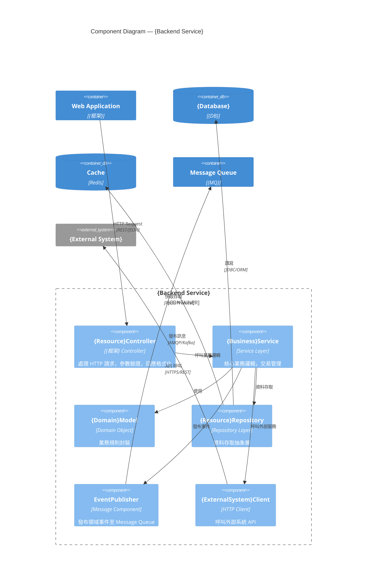
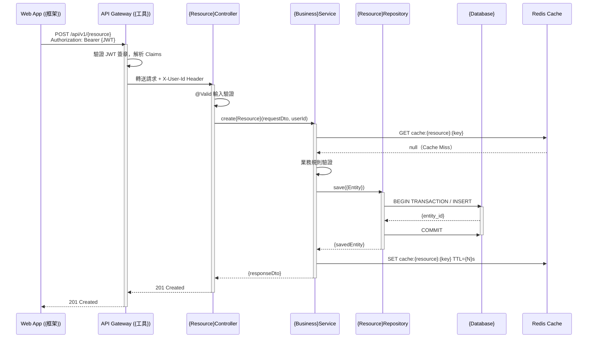

# 系統設計文件 (System Design Document)

**文件編號：** SD-{PROJECT_CODE}-{VERSION}  
**專案名稱：** {PROJECT_NAME}  
**版本：** {VERSION}  
**建立日期：** {DATE}  
**最後更新：** {LAST_UPDATED}  
**文件狀態：** 草稿 / 審查中 / 核准  

---

## 文件修訂紀錄

| 版本 | 日期 | 修訂人 | 修訂說明 |
|------|------|--------|----------|
| 0.1  | {DATE} | {AUTHOR} | 初稿建立 |

---

## 輸入文件參照

| 文件名稱 | 版本 | 說明 |
|---------|------|------|
| FSD-{PROJECT_CODE}-{VERSION}.md | {VERSION} | 功能規格文件（主要輸入來源） |
| 技術架構決策紀錄 (ADR) | {VERSION} | 架構選型依據 |
| 企業技術標準規範 | {VERSION} | 公司技術棧與規範 |
| {DOC_NAME} | {VERSION} | {DESC} |

---

## 1. 文件目的與範圍

### 1.1 目的

本文件依據 **FSD-{PROJECT_CODE}-{VERSION}** 所定義的功能需求，說明 **{PROJECT_NAME}** 系統的整體技術設計，包含架構設計、模組劃分、資料設計、API 設計、部署架構及技術決策，作為開發團隊實作的技術依據。

### 1.2 範圍

| 面向 | 說明 |
|------|------|
| 系統邊界 | {描述系統的邊界與外部整合點} |
| 技術範圍 | {前端、後端、資料庫、基礎設施} |
| 不在範圍 | {明確排除的項目} |

---

## 2. 名詞定義與縮寫

| 名詞 / 縮寫 | 說明 |
|------------|------|
| SD | System Design Document，系統設計文件 |
| FSD | Functional Specification Document，功能規格文件 |
| API | Application Programming Interface |
| ADR | Architecture Decision Record，架構決策紀錄 |
| {TERM} | {DEFINITION} |

---

## 3. 系統架構概觀

### 3.1 架構風格

- **架構模式：** {Monolith / Microservices / Modular Monolith / Event-Driven / ...}
- **部署模式：** {On-Premise / Cloud-Native / Hybrid}
- **雲端平台：** {AWS / Azure / GCP / N/A}

### 3.2 技術標準宣告

> 本節定義專案層級的技術決策，作為 `java-coding-standards` Steering 規範的**專案具體化**，  
> 並作為 `springboot-codegen` Skill 產生程式碼時的強制輸入來源。  
> **所有欄位必須在開發啟動前填寫完畢，禁止留空或使用佔位符。**

#### Package Root（必填）

| 欄位 | 值 | 說明 |
|------|----|------|
| Group ID | `{com.{company}}` | Maven/Gradle groupId，對應公司/組織 |
| Artifact ID | `{project-code}` | Maven/Gradle artifactId，小寫連字號 |
| **Package Root** | `{com.{company}.{projectCode}}` | **Java 根 package，全小寫無連字號** |

**範例：**

| 專案 | Group ID | Artifact ID | Package Root |
|------|----------|-------------|-------------|
| 壽險保費試算 | `com.example` | `life-premium` | `com.example.lifepremium` |
| 電商平台 | `com.acme` | `ecommerce` | `com.acme.ecommerce` |
| HR Portal | `com.mybank` | `hr-portal` | `com.mybank.hrportal` |

#### 技術棧版本（必填）

| 技術 | 版本 | 備註 |
|------|------|------|
| Java | {17 / 21} | 選擇 LTS 版本 |
| Spring Boot | {3.x.x} | |
| 資料庫 | {PostgreSQL {version} / MySQL {version}} | |
| ORM | Spring Data JPA + Hibernate 6 | 企業標準 |
| DTO 映射 | MapStruct {version} | 編譯期生成 |
| 測試框架 | JUnit 5 + Mockito + Cucumber {version} | |
| Build Tool | {Maven / Gradle} | |

### 3.2 高階架構圖

```
┌─────────────────────────────────────────────────────────────┐
│                        Client Layer                          │
│   [Web Browser]        [Mobile App]        [3rd Party]       │
└──────────────┬──────────────────────────────────────────────┘
               │ HTTPS / REST / GraphQL
┌──────────────▼──────────────────────────────────────────────┐
│                      API Gateway / BFF                        │
│           (Auth, Rate Limit, Routing, Load Balance)          │
└──────┬─────────────┬─────────────┬──────────────────────────┘
       │             │             │
┌──────▼──────┐ ┌────▼────┐ ┌─────▼──────┐
│  Service A  │ │Service B│ │  Service C  │
│ {功能模組一} │ │{功能模組二}│ │ {功能模組三} │
└──────┬──────┘ └────┬────┘ └─────┬──────┘
       │             │             │
┌──────▼─────────────▼─────────────▼──────┐
│              Message Bus / Event Bus      │
│           (Kafka / RabbitMQ / SNS+SQS)   │
└──────────────────────┬──────────────────┘
                       │
┌──────────────────────▼──────────────────┐
│                 Data Layer               │
│  [Primary DB]  [Cache]  [Object Storage]│
└─────────────────────────────────────────┘
```

> 請以實際架構圖（如 draw.io、Miro、PlantUML）取代上方 ASCII 示意圖，並嵌入或附件於本文件。

### 3.3 關鍵架構決策

| ADR 編號 | 決策摘要 | 選擇 | 主要理由 |
|---------|---------|------|---------|
| ADR-001 | 前端框架選型 | {React / Vue / Angular} | {理由} |
| ADR-002 | 後端語言與框架 | {Node.js/NestJS / Java/Spring Boot / ...} | {理由} |
| ADR-003 | 資料庫選型 | {PostgreSQL / MySQL / MongoDB / ...} | {理由} |
| ADR-004 | 訊息佇列 | {Kafka / RabbitMQ / N/A} | {理由} |
| {ADR-N} | {DECISION} | {CHOICE} | {REASON} |

---

## 4. C4 L3 — Component Diagram（元件圖）

> 本節針對各主要 Container，說明其內部元件組成與互動，對應 FSD C4 L2 的進一步拆解。  
> 使用 **Mermaid** 繪製，可直接在 GitHub / GitLab 預覽，無需額外工具。

### 4.1 {Backend Service} 元件圖

**Container 職責：** {此 Container 的核心業務職責}



> 圖 4-1：{Backend Service} 元件圖（C4 L3）

**元件清單：**

| 元件名稱 | 類型 | 職責 | 對應 FR |
|---------|------|------|--------|
| `{Resource}Controller` | Controller | HTTP 請求處理、輸入驗證 | FR-{X}-{N} |
| `{Business}Service` | Service | 核心業務邏輯、交易管理 | FR-{X}-{N} |
| `{Domain}Model` | Domain | 業務規則封裝 | — |
| `{Resource}Repository` | Repository | 資料存取抽象 | — |
| `EventPublisher` | Messaging | 領域事件發布 | FR-{X}-{N} |
| `{ExternalSystem}Client` | HTTP Client | 外部系統整合 | FR-{X}-{N} |

---

### 4.2 {Worker Service} 元件圖

```plantuml
### 4.2 {Worker Service} 元件圖

```mermaid
C4Component
  title Component Diagram — {Worker Service}

  Container_Boundary(worker, "{Worker Service}") {
    Component(consumer, "{Event}Consumer", "Message Consumer", "訂閱並消費 Message Queue 事件")
    Component(handler, "{Event}Handler", "Event Handler", "事件處理邏輯")
    Component(retry, "RetryPolicy", "Retry Component", "失敗重試與死信佇列處理")
    Component(notifier, "{Notification}Sender", "Notification", "發送通知（Email / SMS / Push）")
  }

  Container(mq, "Message Queue", "{MQ}", "")
  System_Ext(notification_ext, "{Notification Service}", "第三方通知服務")

  Rel(mq, consumer, "消費訊息", "AMQP/Kafka")
  Rel(consumer, handler, "委派處理")
  Rel(handler, retry, "失敗時")
  Rel(handler, notifier, "觸發通知")
  Rel(notifier, notification_ext, "發送通知", "HTTPS")
```

> 圖 4-2：{Worker Service} 元件圖（C4 L3）

---

## 5. 技術層循序圖

> 本節描述服務間的技術互動時序，聚焦於跨 Container 的呼叫鏈、非同步流程與外部整合，對應 FSD 業務循序圖的技術實作面。  
> 使用 **Mermaid** 繪製，可直接在 GitHub / GitLab 預覽。

### 5.1 {核心技術流程一}（對應 FSD 圖 6-1）

**流程說明：** {說明此技術流程涵蓋的服務邊界與關鍵技術決策}



> 圖 5-1：{技術流程名稱}（同步呼叫鏈）

**技術決策說明：**

| 決策點 | 實作方式 | 說明 |
|--------|---------|------|
| 輸入驗證 | Bean Validation / Zod | Controller 層攔截，統一 400 回應 |
| 快取策略 | Cache-Aside | 先查 Redis，Miss 才查 DB |
| 交易邊界 | `@Transactional` / Unit of Work | Service 層管理 |
| 錯誤處理 | Global Exception Handler | 統一映射至 HTTP 狀態碼 |

---

### 5.2 {非同步流程}（對應 FSD 圖 6-2）

**流程說明：** {說明此非同步流程的觸發時機、訊息契約與最終一致性設計}

```plantuml
@startuml SEQ_TECH_{PROJECT_CODE}_02
title {非同步流程名稱}（Event-Driven）

participant "{Business}Service" as Svc
participant "EventPublisher" as Pub
queue "{Topic/Queue Name}\n({MQ})" as MQ
participant "{Event}Consumer\n(Worker)" as Consumer
participant "{Event}Handler" as Handler
participant "{Notification}Sender" as Notifier
System "{External Notification\nService}" as ExtSvc

Svc -> Pub : publish({DomainEvent})
activate Pub
note right of Pub
  Event Schema:
  {
    "eventId": "uuid",
    "eventType": "{EVENT_TYPE}",
    "aggregateId": "{id}",
    "payload": {...},
    "timestamp": "ISO8601"
  }
end note
Pub -> MQ : 發布訊息（At-Least-Once）
deactivate Pub

MQ -> Consumer : 推送訊息（Consumer Group）
### 5.2 {非同步流程}（對應 FSD 圖 6-2）

**流程說明：** {說明此非同步流程的觸發時機、訊息契約與最終一致性設計}

```mermaid
sequenceDiagram
  participant Svc as {Business}Service
  participant Pub as EventPublisher
  participant MQ as {Topic/Queue Name} ({MQ})
  participant Consumer as {Event}Consumer (Worker)
  participant Handler as {Event}Handler
  participant Notifier as {Notification}Sender
  participant ExtSvc as External Notification Service

  Svc->>Pub: publish({DomainEvent})
  activate Pub
  Note over Pub: eventId, eventType,<br/>aggregateId, payload, timestamp
  Pub->>MQ: 發布訊息 (At-Least-Once)
  deactivate Pub

  MQ->>Consumer: 推送訊息 (Consumer Group)
  activate Consumer
  Consumer->>Handler: handle({DomainEvent})
  activate Handler
  Handler->>Handler: 冪等性檢查 (eventId 去重)

  alt 處理成功
    Handler->>Notifier: sendNotification(payload)
    activate Notifier
    Notifier->>ExtSvc: POST /send {通知內容}
    ExtSvc-->>Notifier: 200 OK
    deactivate Notifier
    Handler->>MQ: ACK（確認消費）
  else 處理失敗（可重試）
    Handler->>MQ: NACK（重新入隊，最多 {N} 次）
  else 超過重試上限
    Handler->>MQ: 移至 Dead Letter Queue
  end

  deactivate Handler
  deactivate Consumer
```

> 圖 5-2：{非同步流程名稱}（Event-Driven）

**非同步設計重點：**

| 項目 | 設計 | 說明 |
|------|------|------|
| 訊息投遞保證 | At-Least-Once | 消費端須實作冪等性 |
| 冪等性機制 | eventId 去重 | 以 eventId 檢查是否已處理 |
| 失敗重試 | 最多 {N} 次，指數退避 | {N}s / {N}s / {N}s |
| 死信佇列 | DLQ-{topic-name} | 超過重試上限後移入，觸發告警 |
| 事件結構版本 | `eventType` 含版本 | 如 `order.created.v1` |

---

## 6. 模組設計

### 6.1 模組清單

| 模組 ID | 模組名稱 | 職責 | 對應 FSD 功能 |
|--------|---------|------|-------------|
| MOD-001 | {MODULE_NAME} | {RESPONSIBILITY} | {FR_IDS} |
| MOD-002 | {MODULE_NAME} | {RESPONSIBILITY} | {FR_IDS} |

### 6.2 模組詳細設計

#### MOD-001：{模組名稱}

**職責：** {說明此模組的單一職責}

**對外介面：**

| 介面類型 | 名稱 | 說明 |
|---------|------|------|
| REST API | `GET /api/v1/{resource}` | {說明} |
| Event (發布) | `{event.name}` | {說明} |
| Event (訂閱) | `{event.name}` | {說明} |

**主要類別 / 服務：**

```
{ModuleName}
├── controller/
│   └── {ResourceController}   # 處理 HTTP 請求
├── service/
│   └── {BusinessService}      # 業務邏輯
├── repository/
│   └── {DataRepository}       # 資料存取
└── dto/
    ├── {CreateRequestDto}
    └── {ResponseDto}
```

**依賴關係：**
- 依賴 MOD-00X（{原因}）
- 被 MOD-00X 依賴（{原因}）

---

## 7. 資料設計

### 7.1 資料庫選型摘要

| 資料庫 | 類型 | 版本 | 用途 |
|--------|------|------|------|
| {DB_NAME} | Relational / Document / Key-Value | {VERSION} | {USE_CASE} |
| {CACHE} | In-Memory Cache | {VERSION} | 快取、Session |

### 7.2 資料模型（ER 圖說明）

> 請附上 ER 圖（draw.io / dbdiagram.io / PlantUML），以下為文字補充說明。

#### 實體：{ENTITY_NAME}

| 欄位名稱 | 資料型態 | 限制 | 說明 |
|---------|---------|------|------|
| id | UUID / BIGINT | PK, NOT NULL | 主鍵 |
| {field_1} | VARCHAR(255) | NOT NULL | {說明} |
| {field_2} | TIMESTAMP | NOT NULL | 建立時間 |
| {field_3} | BOOLEAN | DEFAULT FALSE | {說明} |
| created_at | TIMESTAMP | NOT NULL | 建立時間 |
| updated_at | TIMESTAMP | NOT NULL | 更新時間 |
| deleted_at | TIMESTAMP | NULL | 軟刪除時間戳 |

**索引：**

| 索引名稱 | 欄位 | 類型 | 說明 |
|---------|------|------|------|
| idx_{table}_{field} | {field} | B-Tree | {查詢用途} |
| uq_{table}_{field} | {field} | Unique | 唯一性約束 |

**關聯：**
- 與 `{OTHER_ENTITY}` 為 {1:1 / 1:N / M:N} 關係（透過 {FK/Junction Table}）

---

### 7.3 快取策略

| 快取項目 | TTL | 失效策略 | 說明 |
|---------|-----|---------|------|
| {CACHE_KEY} | {TTL} 秒 | Cache-Aside / Write-Through | {說明} |

---

## 8. API 設計

### 8.1 API 設計原則

- 遵循 RESTful 設計規範
- 版本控制採 URL 路徑方式：`/api/v{N}/`
- 請求 / 回應格式：`application/json`
- 認證方式：Bearer Token（JWT）
- 錯誤回應格式統一如 6.3 節定義

### 8.2 API 清單

| 方法 | 路徑 | 說明 | 認證 | 對應 FR |
|------|------|------|------|--------|
| GET | `/api/v1/{resource}` | 取得清單 | ✓ | FR-{X}-001 |
| GET | `/api/v1/{resource}/{id}` | 取得單筆 | ✓ | FR-{X}-002 |
| POST | `/api/v1/{resource}` | 新增 | ✓ | FR-{X}-003 |
| PUT | `/api/v1/{resource}/{id}` | 全量更新 | ✓ | FR-{X}-004 |
| PATCH | `/api/v1/{resource}/{id}` | 部分更新 | ✓ | FR-{X}-005 |
| DELETE | `/api/v1/{resource}/{id}` | 刪除 | ✓ | FR-{X}-006 |

### 8.3 API 詳細規格

#### `POST /api/v1/{resource}`

**說明：** {功能描述}

**Request Header：**

```
Authorization: Bearer {JWT_TOKEN}
Content-Type: application/json
```

**Request Body：**

```json
{
  "{field_1}": "{type} - {說明}",
  "{field_2}": "{type} - {說明}"
}
```

**Response 200 OK：**

```json
{
  "code": "SUCCESS",
  "data": {
    "id": "{uuid}",
    "{field_1}": "{value}",
    "createdAt": "2025-01-01T00:00:00Z"
  }
}
```

**錯誤回應格式：**

```json
{
  "code": "{ERROR_CODE}",
  "message": "{人類可讀的錯誤訊息}",
  "details": [
    {
      "field": "{欄位名稱}",
      "reason": "{錯誤原因}"
    }
  ],
  "timestamp": "2025-01-01T00:00:00Z",
  "traceId": "{trace-uuid}"
}
```

**HTTP 狀態碼對照：**

| 狀態碼 | 說明 |
|--------|------|
| 200 | 成功 |
| 201 | 建立成功 |
| 400 | 請求格式錯誤 |
| 401 | 未認證 |
| 403 | 未授權 |
| 404 | 資源不存在 |
| 409 | 資料衝突 |
| 422 | 業務邏輯驗證失敗 |
| 500 | 伺服器內部錯誤 |

---

## 9. 安全設計

### 9.1 認證與授權

| 機制 | 說明 |
|------|------|
| 認證方式 | JWT（Access Token 有效期 {N} 分鐘，Refresh Token {N} 天） |
| 授權模式 | RBAC（角色存取控制） / ABAC（屬性存取控制） |
| Token 儲存 | HttpOnly Cookie / Authorization Header |

### 9.2 角色權限矩陣

| 功能 | {ROLE_1} | {ROLE_2} | {ROLE_3} |
|------|---------|---------|---------|
| {FEATURE_1} | ✓ | ✓ | — |
| {FEATURE_2} | ✓ | — | — |
| {FEATURE_3} | ✓ | ✓ | ✓ |

### 9.3 資料安全

| 項目 | 實作方式 |
|------|---------|
| 傳輸加密 | TLS 1.3 |
| 密碼加密 | bcrypt（cost factor 12） |
| 敏感欄位 | AES-256-GCM 加密儲存 |
| SQL Injection 防護 | ORM Parameterized Query |
| XSS 防護 | Content Security Policy + Output Encoding |
| CSRF 防護 | SameSite Cookie + CSRF Token |

---

## 10. 部署架構

### 10.1 環境清單

| 環境 | 用途 | 基礎設施 | URL |
|------|------|---------|-----|
| Development | 開發測試 | {Docker Compose / Local K8s} | localhost |
| Staging | 整合測試 / UAT | {雲端平台 / 規格} | {URL} |
| Production | 正式上線 | {雲端平台 / 規格} | {URL} |

### 10.2 容器化設計

```yaml
# docker-compose 服務概要（實際檔案見 docker-compose.yml）
services:
  frontend:     image: {IMAGE}:{TAG}   port: 3000
  backend:      image: {IMAGE}:{TAG}   port: 8080
  database:     image: postgres:{VER}  port: 5432
  cache:        image: redis:{VER}     port: 6379
  queue:        image: {IMAGE}:{TAG}   port: {PORT}
```

### 10.3 CI/CD 流程

```
Developer Push
    │
    ▼
[GitHub Actions / GitLab CI]
    ├─ Lint & Unit Test
    ├─ Build Docker Image
    ├─ Security Scan (Trivy / Snyk)
    ├─ Push to Container Registry
    │
    ▼ (main branch)
[CD Pipeline]
    ├─ Deploy to Staging → Run Integration Test
    └─ Manual Approval → Deploy to Production
```

---

## 11. 可觀測性設計

### 11.1 日誌規範

| 項目 | 規格 |
|------|------|
| 日誌格式 | JSON 結構化日誌 |
| 必要欄位 | timestamp, level, service, traceId, spanId, message |
| 收集工具 | {ELK Stack / Loki / CloudWatch} |
| 保留期限 | {N} 天 |

### 9.2 監控指標

| 指標 | 類型 | 警示閾值 |
|------|------|---------|
| HTTP 請求延遲 P99 | Histogram | > {N} ms |
| 錯誤率 | Gauge | > {N}% |
| CPU 使用率 | Gauge | > {N}% |
| 記憶體使用率 | Gauge | > {N}% |

### 9.3 分散式追蹤

- 工具：{Jaeger / Zipkin / AWS X-Ray / Datadog}
- 所有服務間呼叫傳遞 `traceId` 與 `spanId`

---

## 10. 效能設計

### 10.1 效能目標

| 指標 | 目標值 | 量測方法 |
|------|--------|---------|
| API P95 回應時間 | ≤ {N} ms | k6 / Gatling |
| 頁面首次內容渲染 | ≤ {N} 秒 | Lighthouse |
| 最大並發使用者 | {N} | 壓力測試 |

### 10.2 效能策略

| 策略 | 適用場景 | 說明 |
|------|---------|------|
| 資料庫索引 | 高頻查詢欄位 | 見 5.2 節索引設計 |
| Redis 快取 | 熱點資料 / Session | 見 5.3 節快取策略 |
| 分頁查詢 | 清單 API | Cursor-based / Offset-based |
| 非同步處理 | 耗時操作 | Message Queue + Worker |
| CDN | 靜態資源 | {CloudFront / Cloudflare} |

---

## 11. 錯誤處理與回復策略

### 11.1 錯誤分類

| 錯誤類型 | 處理方式 | 通知方式 |
|---------|---------|---------|
| 客戶端錯誤（4xx） | 回傳結構化錯誤訊息 | 不通知 |
| 伺服器錯誤（5xx） | 記錄 Error Log + 通知 | PagerDuty / Slack |
| 外部服務超時 | Retry + Circuit Breaker | 告警 |

### 11.2 Circuit Breaker 設定

| 服務 | 失敗閾值 | 等待時間 | 半開探測 |
|------|---------|---------|---------|
| {EXTERNAL_SERVICE} | {N} 次 / {N} 秒 | {N} 秒 | 1 次試探 |

---

## 12. 技術債與已知限制

| 項目 | 說明 | 風險等級 | 預計處理版本 |
|------|------|---------|------------|
| {TECH_DEBT_1} | {DESC} | 高 / 中 / 低 | v{VERSION} |

---

## 13. 審查與核准

| 角色 | 姓名 | 簽核日期 | 備註 |
|------|------|---------|------|
| 技術架構師 | {NAME} | {DATE} | |
| 技術主管 | {NAME} | {DATE} | |
| 資安負責人 | {NAME} | {DATE} | |
| 品保主管 | {NAME} | {DATE} | |
| 產品負責人 | {NAME} | {DATE} | |

---

*本文件由 Kiro SDLC 工作流程產生，依據 FSD-{PROJECT_CODE}-{VERSION} 撰寫。版本控制請參考 Git 歷史紀錄。*
